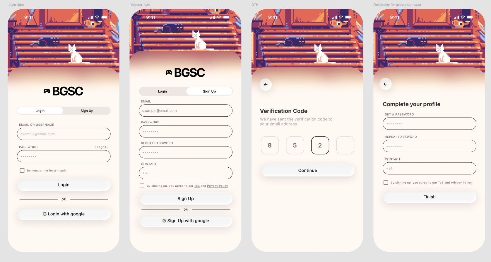
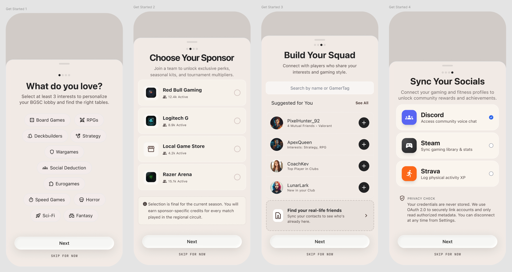
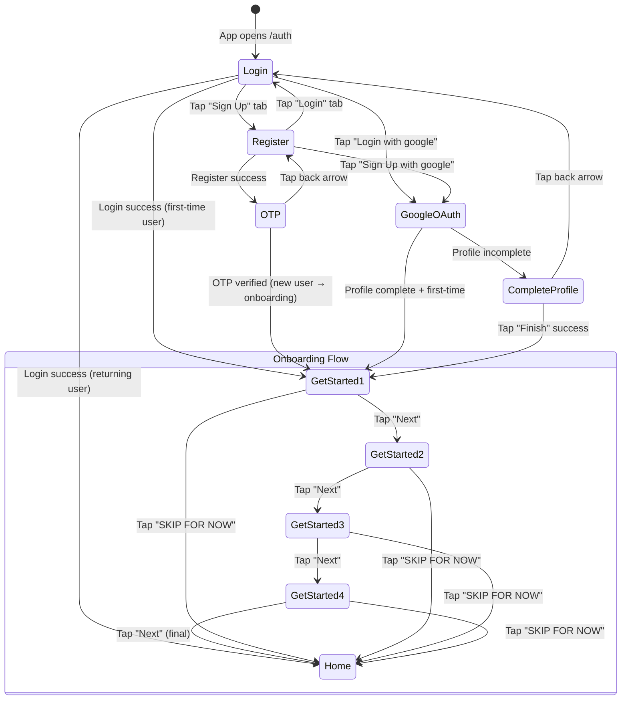

# BGSC Authentication Screens — Design Specification

> **Document version:** 1.0  
> **Last updated:** 2026-08-08
> **Target:** Mobile-first React Native / React (responsive web PWA)  
> **Screens covered:** Login · Sign Up · OTP Verification · Complete Profile (Google Sign-Up only) · Get Started 1–4 (Onboarding)

---

## 📸 Reference Screenshots






> [!IMPORTANT]
> The implementation must reproduce all eight screens **pixel-for-pixel** against these references. Every spacing value, color, radius, font weight, and animation described below is derived directly from the screenshots. The **teal/green color palette** shown above is the canonical color system for the entire auth + onboarding flow.

---

## Table of Contents

1. [Tech Stack & OSS Libraries](#1-tech-stack--oss-libraries)
2. [Global Design Tokens](#2-global-design-tokens)
3. [Shared Components](#3-shared-components)
4. [Screen 1 — Login (Light)](#4-screen-1--login-light)
5. [Screen 2 — Register (Light)](#5-screen-2--register-light)
6. [Screen 3 — OTP Verification](#6-screen-3--otp-verification)
7. [Screen 4 — Complete Your Profile (Google Sign-Up)](#7-screen-4--complete-your-profile-google-sign-up)
8. [Screen 5 — Get Started 1: What Do You Love? (Interests)](#8-screen-5--get-started-1-what-do-you-love-interests)
9. [Screen 6 — Get Started 2: Choose Your Sponsor](#9-screen-6--get-started-2-choose-your-sponsor)
10. [Screen 7 — Get Started 3: Build Your Squad](#10-screen-7--get-started-3-build-your-squad)
11. [Screen 8 — Get Started 4: Sync Your Socials](#11-screen-8--get-started-4-sync-your-socials)
12. [Animation & Interaction Spec](#12-animation--interaction-spec)
13. [Accessibility & Edge Cases](#13-accessibility--edge-cases)
14. [Asset Manifest](#14-asset-manifest)
15. [State Machine & Navigation Flow](#15-state-machine--navigation-flow)

---

## 1. Tech Stack & OSS Libraries

> [!NOTE]
> The BGSC platform is a mobile-first PWA with companion native apps. The auth screens are shared across web and native via React / React Native with maximum code reuse.

### Core Framework

| Layer | Technology | Notes |
|---|---|---|
| **UI Framework** | React 18+ / React Native | Shared component logic; platform-specific renderers |
| **Routing** | React Router v6 (web) / React Navigation v6 (native) | Nested stack for auth flow |
| **State** | Zustand or Jotai | Lightweight auth state store |
| **Forms** | React Hook Form + Zod | Schema-based validation with performant re-renders |
| **API** | TanStack Query v5 | Mutation hooks for login/register/OTP/profile |

### Animation & Motion (Mandatory OSS Tools)

| Library | Version | Purpose | Install |
|---|---|---|---|
| **Framer Motion** | `^11.x` | Page transitions, input focus animations, button press spring, tab slider, hero image parallax | `npm i framer-motion` |
| **GSAP** (GreenSock) | `^3.12` | Pixel-art cat GIF shimmer overlay, scroll-triggered reveal on long register form, OTP digit pop-in sequence | `npm i gsap` |
| **Lenis** | `^1.1` | Butter-smooth native scroll on the Register page (which overflows viewport); inertia-based momentum | `npm i lenis` |
| **React Bits** | `latest` | Pre-built micro-interaction primitives: ripple buttons, animated checkboxes, toast notifications for validation errors | `npm i react-bits` |

### Typography

| Font | Weight(s) | Usage | Source |
|---|---|---|---|
| **Helvetica Neue** | 400 (Regular), 500 (Medium), 700 (Bold) | Primary typeface — all headings, labels, body text, placeholders | System font stack / licensed web font. Fallback: `"Helvetica Neue", Helvetica, Arial, sans-serif` |

> **Font migration note:** `Helvetica Neue` is iOS-only and unavailable cross-platform. When rebuilding auth screens, replace with `Inter` (body/UI) and `BarlowCondensed_700Bold` (section headings), per `UI-UX-Master-Doc.md §5`. Helvetica Neue is documented here for backward-compat with existing native screens only.
| **SF Pro Display** | 600 (Semibold) | Status bar clock (iOS chrome only — native) | System |
| **Monospace** (JetBrains Mono or SF Mono) | 500 | OTP digit boxes only | `fonts.google.com` for JetBrains Mono |

> [!TIP]
> For the web build, load Helvetica Neue via `@font-face` with `font-display: swap`. If licensing is an issue, use **Inter** (`fonts.google.com/specimen/Inter`) as a near-identical free substitute at weights 400, 500, 700.

---

## 2. Global Design Tokens

### 2.1 Color Palette — Teal/Green System

Derived from the canonical palette: `#051F20` → `#0B2B26` → `#163832` → `#235347` → `#8EB69B` → `#DAF1DE`

```
/* ─── Canonical Palette (from colorscheme.png) ─── */

--color-teal-900:             #051F20;        /* Deepest teal — near black */
--color-teal-800:             #0B2B26;        /* Dark forest teal */
--color-teal-700:             #163832;        /* Deep teal */
--color-teal-600:             #235347;        /* Rich teal — primary brand accent */
--color-teal-300:             #8EB69B;        /* Muted sage green — secondary */
--color-teal-100:             #DAF1DE;        /* Lightest mint — wash / backgrounds */

/* ─── Semantic Mappings (Light Theme — auth + onboarding screens) ─── */

--color-bg-page:              #FAF7F2;        /* Warm cream — light mode canvas (semantic token: background light) */
--color-bg-card:              #FFFFFF;        /* Pure white for input fields, cards */
--color-bg-input:             #FFFFFF;        /* Input background */
--color-bg-button-primary:    #235347;        /* Rich teal — primary CTA fill */
--color-bg-button-google:     #DAF1DE;        /* Mint wash — Google / secondary button fill */
--color-bg-tab-active:        #FFFFFF;        /* Active tab pill */
--color-bg-tab-track:         #C2E5C8;        /* Soft green tint — tab bar track (derived: midpoint #8EB69B ↔ #DAF1DE) */
--color-bg-otp-filled:        #FFFFFF;        /* OTP box with digit */
--color-bg-otp-empty:         #DAF1DE;        /* Mint wash — empty OTP box */
--color-bg-onboarding-card:   #FFFFFF;        /* Get Started content cards */
--color-bg-chip:              #FFFFFF;        /* Interest tag chip background */
--color-bg-chip-selected:     #235347;        /* Interest tag chip selected fill */
--color-bg-sponsor-row:       #FFFFFF;        /* Sponsor list row background */
--color-bg-friend-avatar:     #8EB69B;        /* Default avatar placeholder ring */
--color-bg-social-card:       #FFFFFF;        /* Social integration card */
--color-bg-social-connected:  #DAF1DE;        /* Connected social card tint */

--color-border-input:         #8EB69B;        /* Sage green border — inputs */
--color-border-input-focus:   #235347;        /* Rich teal — input focus border */
--color-border-otp:           #235347;        /* OTP box border */
--color-border-checkbox:      #235347;        /* Checkbox border */
--color-border-chip:          #8EB69B;        /* Interest chip border (unselected) */
--color-border-card:          #C2E5C8;        /* Card border for Get Started */

--color-text-primary:         #051F20;        /* Deepest teal — headings, button labels on light bg, input text */
--color-text-on-primary:      #FFFFFF;        /* White — text on --color-bg-button-primary */
--color-text-secondary:       #235347;        /* Rich teal — labels above inputs */
--color-text-placeholder:     #8EB69B;        /* Sage — input placeholder text */
--color-text-link:            #163832;        /* Deep teal — "Forgot?", ToS, Privacy Policy — underlined */
--color-text-divider:         #8EB69B;        /* Sage — "OR" divider text */
--color-text-chip:            #235347;        /* Chip label (unselected) */
--color-text-chip-selected:   #FFFFFF;        /* Chip label (selected) */
--color-text-meta:            #8EB69B;        /* Sponsor member count, friend subtitle */
--color-text-skip:            #235347;        /* "SKIP FOR NOW" label */

--color-divider-line:         #8EB69B;        /* Horizontal rule in "—— OR ——" */

--color-icon-back:            #051F20;        /* Back arrow icon */
--color-icon-google:          multicolor;     /* Standard Google "G" logo colors */
--color-icon-add-friend:      #235347;        /* "+" icon on friend suggestion rows */
--color-icon-chip:            #235347;        /* Icon inside interest chips */

--color-progress-dot-active:  #235347;        /* Active dot in Get Started progress indicator */
--color-progress-dot-inactive:#8EB69B;        /* Inactive dot in Get Started progress indicator */
--color-radio-unselected:     #8EB69B;        /* Sponsor selection radio border */
--color-radio-selected:       #235347;        /* Sponsor selection radio fill */
--color-check-connected:      #235347;        /* Checkmark for connected social accounts */

/* ─── Accent / Status ─── */

--color-error:                #D94F4F;        /* Error states — unchanged, red is universal */
--color-success:              #235347;        /* Success feedback — uses brand teal */
--color-info-bg:              #DAF1DE;        /* Info banner background */
--color-info-icon:            #163832;        /* Info ⓘ icon */
```

### 2.2 Spacing Scale (mobile — 375pt viewport)

```
--space-xs:    4px;
--space-sm:    8px;
--space-md:    12px;
--space-base:  16px;
--space-lg:    20px;
--space-xl:    24px;
--space-2xl:   32px;
--space-3xl:   40px;
--space-4xl:   48px;
```

### 2.3 Border Radius

```
--radius-input:     12px;     /* All text inputs */
--radius-button:    14px;     /* Primary + Google buttons */
--radius-tab-track: 12px;     /* Tab bar container */
--radius-tab-pill:  10px;     /* Active tab pill */
--radius-otp:       12px;     /* OTP digit boxes */
--radius-checkbox:  4px;      /* Checkbox */
--radius-back-btn:  50%;      /* Circular back button */
```

### 2.4 Typography Scale

```
--font-family:          "Helvetica Neue", Helvetica, Arial, sans-serif;
--font-family-mono:     "JetBrains Mono", "SF Mono", monospace;

--text-logo:            24px / 1.2  / 700;      /* "BGSC" next to icon */
--text-heading:         24px / 1.3  / 700;      /* "Verification Code", "Complete your profile" */
--text-label:           11px / 1.0  / 500;      /* "EMAIL OR USERNAME", "PASSWORD", etc — ALL CAPS, letter-spacing: 0.8px */
--text-input:           15px / 1.4  / 400;      /* Input value text */
--text-placeholder:     15px / 1.4  / 400;      /* Placeholder text */
--text-button:          16px / 1.0  / 600;      /* "Login", "Sign Up", "Continue", "Finish" */
--text-tab:             14px / 1.0  / 500;      /* Tab labels "Login" / "Sign Up" */
--text-caption:         12px / 1.4  / 400;      /* "Remember me for a month", ToS line */
--text-link:            12px / 1.4  / 500;      /* "Forgot?", "ToS", "Privacy Policy" — underlined */
--text-divider:         12px / 1.0  / 400;      /* "OR" */
--text-subtitle:        14px / 1.5  / 400;      /* OTP subtitle "We have sent the verification code…" */
--text-otp-digit:       24px / 1.0  / 600;      /* Digits inside OTP boxes */
```

### 2.5 Elevation / Shadows

```
--shadow-button:   0 2px 8px rgba(5, 31, 32, 0.10);    /* Subtle lift, tinted with teal-900 */
--shadow-input:    none;                                 /* Inputs are flat, border-only */
--shadow-back-btn: 0 2px 12px rgba(5, 31, 32, 0.14);    /* Back arrow circle — teal tint */
--shadow-card:     0 1px 4px rgba(5, 31, 32, 0.06);     /* Subtle card lift for Get Started cards */
--shadow-chip:     none;                                 /* Interest chips are flat */
```

### 2.6 Transitions (defaults)

```
--ease-default:    cubic-bezier(0.25, 0.1, 0.25, 1);
--duration-fast:   150ms;
--duration-base:   250ms;
--duration-slow:   400ms;
```

---

## 3. Shared Components

### 3.1 Hero Image Banner

This is the **most distinctive visual element** — a pixel-art illustration occupying the top ~35–40% of the screen.

| Property | Value |
|---|---|
| **Asset** | `cat.gif` (placeholder — animated pixel-art GIF showing a white cat sitting on pixel stairs/steps with a warm sunset-toned pixel cityscape/building backdrop) |
| **Aspect ratio** | Approx. 16:9 within the banner zone |
| **Height** | `~280px` on 375pt viewport (adjusts proportionally) |
| **Width** | `100%` of screen — full bleed, edge to edge |
| **Bottom edge** | Gentle gradient fade from the pixel art into `--color-bg-page`. Use a `linear-gradient` overlay on the bottom 60px: `transparent → var(--color-bg-page)` |
| **Border radius** | `0` (top flush with screen edge) |
| **Object fit** | `cover`, centered horizontally, anchored to top |
| **Parallax (Framer Motion)** | Apply `useScroll` + `useTransform` to translate the image upward at 0.3× scroll speed as user scrolls the form. Creates depth. |
| **GSAP shimmer** | A subtle diagonal light sweep across the pixel art every 6 seconds. Use GSAP `gsap.to()` on a translucent white overlay div with `skewX(-20deg)` translating from left to right over 1.5s. |

```css
/* Gradient fade overlay at bottom of hero */
.hero-fade {
  position: absolute;
  bottom: 0;
  left: 0;
  right: 0;
  height: 60px;
  background: linear-gradient(to bottom, transparent, var(--color-bg-page));
  pointer-events: none;
}
```

### 3.2 BGSC Logo Lockup

| Property | Value |
|---|---|
| **Layout** | Horizontal: `[icon] [8px gap] [text]` centered on the X-axis |
| **Icon** | Gamepad / controller icon (pixel-art style, solid, ~24×24px). Matches the two-toned pixel controller visible in the screenshot. Use an SVG or icon font glyph. |
| **Text** | `"BGSC"` — `--text-logo` (24px, bold 700, `--color-text-primary`) |
| **Margin top** | `--space-lg` (20px) below the hero image fade |
| **Margin bottom** | `--space-xl` (24px) before the tab bar |

### 3.3 Auth Tab Bar (Login / Sign Up toggle)

This is a **segmented control** — two tabs inside a rounded track.

| Property | Value |
|---|---|
| **Container** | `width: 100%; max-width: 280px; height: 44px; border-radius: var(--radius-tab-track); background: var(--color-bg-tab-track); padding: 3px;` centered horizontally |
| **Tab pill (active)** | `background: var(--color-bg-tab-active); border-radius: var(--radius-tab-pill); box-shadow: var(--shadow-button);` |
| **Tab pill animation** | **Framer Motion `layout` transition** — the white pill slides left/right with a spring animation: `type: "spring", stiffness: 400, damping: 30`. This is critical for the feel. |
| **Tab label (active)** | `--text-tab`, color `--color-text-primary`, font-weight 600 |
| **Tab label (inactive)** | `--text-tab`, color `--color-text-secondary`, font-weight 400 |
| **Margin bottom** | `--space-2xl` (32px) before first input label |

```jsx
// Framer Motion segmented control concept
<motion.div className="tab-pill" layoutId="activeTab" 
  transition={{ type: "spring", stiffness: 400, damping: 30 }} />
```

### 3.4 Text Input Field

| Property | Value |
|---|---|
| **Label** | Positioned ABOVE the input, left-aligned. ALL CAPS. `--text-label` (11px, medium 500, `--color-text-secondary`, `letter-spacing: 0.8px`). Margin-bottom `--space-sm` (8px) to input. |
| **Input container** | `height: 48px; border: 1.5px solid var(--color-border-input); border-radius: var(--radius-input); background: var(--color-bg-input); padding: 0 16px;` |
| **Input text** | `--text-input` (15px, regular 400, `--color-text-primary`) |
| **Placeholder** | `--text-placeholder` (15px, regular 400, `--color-text-placeholder`) |
| **Focus state** | Border color transitions to `--color-border-input-focus` with `--duration-fast`. **Framer Motion**: `animate={{ scale: 1.01 }}` on focus for a micro-lift, revert on blur. |
| **Error state** | Border color `#D94F4F`, label turns `#D94F4F`, error message appears below in 11px regular. Use **React Bits** toast or inline error. |
| **Spacing** | `margin-bottom: var(--space-lg)` (20px) between each label+input group |
| **Password type** | `type="password"` with bullet masking (`•••••••••`) |

### 3.5 Primary Action Button

| Property | Value |
|---|---|
| **Height** | `52px` |
| **Width** | `100%` (full width within content padding) |
| **Background** | `var(--color-bg-button-primary)` — rich teal (#235347) |
| **Border** | `1.5px solid var(--color-border-input)` |
| **Border radius** | `var(--radius-button)` (14px) |
| **Text** | `--text-button` (16px, semibold 600, `--color-text-on-primary` — white), centered |
| **Shadow** | `var(--shadow-button)` |
| **Press animation (Framer Motion)** | `whileTap={{ scale: 0.97 }}` with spring. |
| **Hover (web)** | `background` lightens to `#2A6354`, cursor pointer |
| **Loading state** | Replace text with a subtle 20px spinner (CSS animation or Framer Motion rotate). Button stays same size. |
| **Disabled state** | `opacity: 0.5; pointer-events: none;` |

### 3.6 Google OAuth Button

| Property | Value |
|---|---|
| **Layout** | Same dimensions as Primary Button but with `[Google "G" icon 20×20] [10px gap] [label text]` centered |
| **Icon** | Standard 4-color Google "G" SVG (`#4285F4`, `#EA4335`, `#FBBC05`, `#34A853`) |
| **Label** | `"Login with google"` or `"Sign Up with google"` — `--text-button` |
| **Background** | `var(--color-bg-button-google)` (mint wash #DAF1DE) |
| **Border** | `1.5px solid var(--color-border-input)` |
| **Border radius** | `var(--radius-button)` |
| **Press animation** | Same `whileTap={{ scale: 0.97 }}` |

### 3.7 Divider with "OR"

| Property | Value |
|---|---|
| **Layout** | `[line] [gap 12px] [text "OR"] [gap 12px] [line]` — centered horizontally |
| **Line** | `flex: 1; height: 1px; background: var(--color-divider-line);` |
| **Text** | `--text-divider` (12px, regular, `--color-text-divider`) |
| **Margin** | `var(--space-lg)` (20px) above and below |

### 3.8 Checkbox + Label

| Property | Value |
|---|---|
| **Checkbox** | `18×18px`, `border: 1.5px solid var(--color-border-checkbox)`, `border-radius: var(--radius-checkbox)`, unchecked background transparent |
| **Checked state** | Fill `--color-text-primary`, white checkmark SVG inside. Use **React Bits** animated checkbox or Framer Motion scale-in. |
| **Label** | Inline with checkbox, `--space-sm` (8px) gap. `--text-caption` (12px, regular, `--color-text-secondary`) |
| **Tappable area** | Entire row (checkbox + label) is tappable. Min 44px touch target height. |

### 3.9 Back Arrow Button (OTP + Complete Profile screens)

| Property | Value |
|---|---|
| **Size** | `40×40px` circle |
| **Background** | `#FFFFFF` |
| **Shadow** | `var(--shadow-back-btn)` |
| **Border radius** | `50%` |
| **Icon** | Left-pointing arrow (`←`), 20px, `--color-icon-back` |
| **Position** | `top: var(--space-base) below status bar`, `left: var(--space-base)` |
| **Tap animation** | `whileTap={{ scale: 0.9 }}` |

---

## 4. Screen 1 — Login (Light)

> **Route:** `/auth/login`  
> **Screen label in design:** `Login_light`

### 4.1 Full Layout (top to bottom)

```
┌─────────────────────────────────────┐
│          STATUS BAR (system)        │  ← iOS status bar: 9:41, signal, wifi, battery
│                                     │
│         ┌───────────────────┐       │
│         │                   │       │
│         │   HERO IMAGE      │       │  ← cat.gif pixel art, full-bleed, ~280px
│         │   (cat.gif)       │       │
│         │                   │       │
│         └───────────────────┘       │
│         ~~~ gradient fade ~~~       │  ← 60px gradient to bg
│                                     │
│         🎮 BGSC                     │  ← Logo lockup, centered
│                                     │     24px below fade
│     ┌──────────┬──────────┐         │
│     │  Login   │  Sign Up │         │  ← Tab bar, "Login" active (white pill)
│     └──────────┴──────────┘         │     24px below logo
│                                     │     32px below tab to first label
│     EMAIL OR USERNAME               │  ← Label: 11px, uppercase, medium 500
│     ┌─────────────────────┐         │
│     │ example@email.com   │         │  ← Input: 48px h, 12px radius
│     └─────────────────────┘         │     20px below to next group
│                                     │
│     PASSWORD              Forgot?   │  ← Label left + "Forgot?" link right-aligned
│     ┌─────────────────────┐         │     "Forgot?" is underlined, 12px, medium 500
│     │ ●●●●●●●●●           │         │  ← Password masked
│     └─────────────────────┘         │
│                                     │     12px below input
│     ☐ Remember me for a month       │  ← Checkbox + caption
│                                     │     24px below checkbox
│     ┌─────────────────────┐         │
│     │       Login         │         │  ← Primary button, 52px h
│     └─────────────────────┘         │
│                                     │     20px
│     ─────────── OR ───────────      │  ← Divider
│                                     │     20px
│     ┌─────────────────────┐         │
│     │  G  Login with google│        │  ← Google button
│     └─────────────────────┘         │
│                                     │
└─────────────────────────────────────┘
```

### 4.2 Content Padding

- Horizontal: `var(--space-xl)` (24px) on each side → content width = `375 - 48 = 327px`

### 4.3 Specific Elements

#### "Forgot?" Link
- **Position:** Right-aligned on the same line as the `PASSWORD` label
- **Style:** `--text-link` (12px, medium 500, `--color-text-link`), `text-decoration: underline`
- **Tap:** Navigates to password reset flow (out of scope for this spec)

#### "Remember me for a month" Checkbox
- Uses Shared Component 3.8
- **Label text:** `"Remember me for a month"`
- **Default state:** Unchecked
- **Margin-top from password input:** `var(--space-md)` (12px)

### 4.4 Interaction Behaviors

| Action | Behavior |
|---|---|
| Tap "Sign Up" tab | Framer Motion `layoutId` pill slides right → navigate to Register screen. Form cross-fades with `AnimatePresence`. |
| Tap "Login" button | Validate fields → call `/api/auth/login` → on success redirect to Home. On error, show inline error below relevant field. |
| Tap "Login with google" | Trigger OAuth popup/redirect → on success, check if profile is complete. If not → Screen 4 (Complete Profile). If yes → Home. |
| Tap "Forgot?" | Navigate to `/auth/forgot-password` (not spec'd here) |

### 4.5 Validation Rules

| Field | Rule | Error Message |
|---|---|---|
| Email or Username | Required, min 3 chars | `"Please enter your email or username"` |
| Password | Required, min 8 chars | `"Password must be at least 8 characters"` |

---

## 5. Screen 2 — Register (Light)

> **Route:** `/auth/register`  
> **Screen label in design:** `Register_light`

### 5.1 Full Layout

```
┌─────────────────────────────────────┐
│          STATUS BAR (system)        │
│                                     │
│         ┌───────────────────┐       │
│         │   HERO IMAGE      │       │  ← Same cat.gif, same parallax
│         │   (cat.gif)       │       │
│         └───────────────────┘       │
│         ~~~ gradient fade ~~~       │
│                                     │
│         🎮 BGSC                     │  ← Logo lockup
│                                     │
│     ┌──────────┬──────────┐         │
│     │  Login   │  Sign Up │         │  ← Tab bar, "Sign Up" active (white pill on RIGHT)
│     └──────────┴──────────┘         │
│                                     │     32px to first label
│     EMAIL                           │  ← Label
│     ┌─────────────────────┐         │
│     │ example@email.com   │         │  ← Input with placeholder
│     └─────────────────────┘         │     20px gap
│                                     │
│     PASSWORD                        │  ← Label (no "Forgot?" link on register)
│     ┌─────────────────────┐         │
│     │ ●●●●●●●●●           │         │
│     └─────────────────────┘         │     20px gap
│                                     │
│     REPEAT PASSWORD                 │  ← Label
│     ┌─────────────────────┐         │
│     │ ●●●●●●●●●           │         │
│     └─────────────────────┘         │     20px gap
│                                     │
│     CONTACT                         │  ← Label
│     ┌─────────────────────┐         │
│     │ +91                 │         │  ← Phone input with country prefix
│     └─────────────────────┘         │
│                                     │     16px
│     ☐ By signing up, you agree      │  ← Checkbox + ToS/Privacy text
│       to our ToS and Privacy        │
│       Policy.                       │
│                                     │     24px
│     ┌─────────────────────┐         │
│     │      Sign Up        │         │  ← Primary button
│     └─────────────────────┘         │
│                                     │     20px
│     ─────────── OR ───────────      │  ← Divider
│                                     │     20px
│     ┌─────────────────────┐         │
│     │ G  Sign Up with google│       │  ← Google button
│     └─────────────────────┘         │
│                                     │
└─────────────────────────────────────┘
```

### 5.2 Scrollability

> [!IMPORTANT]
> This screen **overflows the viewport** on shorter devices. Initialize **Lenis** smooth scroll on this page.

```js
// Lenis initialization for Register screen
import Lenis from 'lenis';

const lenis = new Lenis({
  duration: 1.2,
  easing: (t) => Math.min(1, 1.001 - Math.pow(2, -10 * t)),
  orientation: 'vertical',
  smoothWheel: true,
});

function raf(time) {
  lenis.raf(time);
  requestAnimationFrame(raf);
}
requestAnimationFrame(raf);
```

### 5.3 Specific Elements

#### Email Input
- **Label:** `"EMAIL"` (not "EMAIL OR USERNAME" — register only asks for email)
- **Placeholder:** `"example@email.com"`

#### Password Input
- **Label:** `"PASSWORD"` (NO "Forgot?" link)
- **Placeholder:** Bullet mask `●●●●●●●●●`

#### Repeat Password Input
- **Label:** `"REPEAT PASSWORD"`
- **Placeholder:** Bullet mask `●●●●●●●●●`
- **Live validation:** If the value doesn't match the Password field, show inline error `"Passwords do not match"` after blur. Border turns error red.

#### Contact Input
- **Label:** `"CONTACT"`
- **Default value / prefix:** `"+91"` — left-aligned inside the input. This is **pre-filled text**, not a separate element.
- **Input type:** `tel`
- **Placeholder (after +91):** None visible — just `+91` sits at the start

#### Terms Checkbox
- **Checkbox** + multi-line caption
- **Text:** `"By signing up, you agree to our ToS and Privacy Policy."`
- **"ToS"** — underlined, tappable link → opens Terms of Service
- **"Privacy Policy"** — underlined, tappable link → opens Privacy Policy
- Both links use `--text-link` style (12px, medium 500, underline)
- **Required:** Must be checked to enable Sign Up button. If unchecked and user taps Sign Up, highlight checkbox in error red.

### 5.4 Interaction Behaviors

| Action | Behavior |
|---|---|
| Tap "Login" tab | Pill slides left → navigate to Login. Form cross-fades. |
| Tap "Sign Up" | Validate all → call `/api/auth/register` → on success → Screen 3 (OTP). |
| Tap "Sign Up with google" | OAuth flow → if email not in system, create account → Screen 4 (Complete Profile). |
| Scroll form | **Lenis** smooth scroll. Hero image has Framer Motion parallax (moves slower than content). |

### 5.5 Validation Rules

| Field | Rule | Error Message |
|---|---|---|
| Email | Required, valid email format | `"Please enter a valid email address"` |
| Password | Required, min 8 chars, 1 uppercase, 1 number | `"Min 8 chars, 1 uppercase, 1 number"` |
| Repeat Password | Must match Password | `"Passwords do not match"` |
| Contact | Required, valid phone with country code | `"Please enter a valid phone number"` |
| ToS checkbox | Must be checked | `"You must accept the Terms of Service"` |

### 5.6 GSAP Scroll Reveal

As the user scrolls down to reveal more form fields, each field group should **fade in + slide up** using GSAP ScrollTrigger:

```js
import { gsap } from 'gsap';
import { ScrollTrigger } from 'gsap/ScrollTrigger';

gsap.registerPlugin(ScrollTrigger);

// Each .form-group fades in as it enters viewport
gsap.utils.toArray('.form-group').forEach((group, i) => {
  gsap.from(group, {
    y: 30,
    opacity: 0,
    duration: 0.6,
    delay: i * 0.08,
    ease: 'power2.out',
    scrollTrigger: {
      trigger: group,
      start: 'top 90%',
      toggleActions: 'play none none none',
    },
  });
});
```

---

## 6. Screen 3 — OTP Verification

> **Route:** `/auth/verify-otp`  
> **Screen label in design:** `OTP`

### 6.1 Full Layout

```
┌─────────────────────────────────────┐
│          STATUS BAR (system)        │
│                                     │
│         ┌───────────────────┐       │
│         │   HERO IMAGE      │       │  ← Same cat.gif
│         │   (cat.gif)       │       │
│         └───────────────────┘       │
│         ~~~ gradient fade ~~~       │
│                                     │
│  (←)                                │  ← Back arrow button (circular, top-left, white bg, shadow)
│                                     │     Overlaps the hero/form transition zone
│                                     │
│     Verification Code               │  ← Heading: 24px, bold 700
│                                     │     8px gap
│     We have sent the verification   │  ← Subtitle: 14px, regular 400,
│     code to your email address      │     --color-text-secondary, max 2 lines
│                                     │     32px gap
│     ┌───┐  ┌───┐  ┌───┐  ┌───┐     │
│     │ 8 │  │ 5 │  │ 2 │  │   │     │  ← 4 OTP digit boxes
│     └───┘  └───┘  └───┘  └───┘     │     3 filled, 1 empty (awaiting input)
│                                     │     40px gap
│     ┌─────────────────────┐         │
│     │     Continue        │         │  ← Primary button
│     └─────────────────────┘         │
│                                     │
└─────────────────────────────────────┘
```

### 6.2 Key Differences from Login/Register

- **No tab bar** — this is a dedicated step
- **No logo lockup** — replaced by back arrow + heading
- **Back arrow** is present (shared component 3.9)
- **No Google button or divider**
- **Content is vertically centered** in the space below the hero

### 6.3 OTP Digit Boxes

| Property | Value |
|---|---|
| **Count** | 4 boxes |
| **Size** | `56×56px` each |
| **Gap** | `var(--space-md)` (12px) between each |
| **Alignment** | Centered horizontally as a row |
| **Border** | `1.5px solid var(--color-border-otp)` |
| **Border radius** | `var(--radius-otp)` (12px) |
| **Background (empty)** | `var(--color-bg-otp-empty)` (warm off-white) |
| **Background (filled)** | `var(--color-bg-otp-filled)` (white) |
| **Digit text** | `--text-otp-digit` (24px, semibold 600, `--font-family-mono`, `--color-text-primary`), centered in box |
| **Caret** | Hidden — use a blinking underscore or subtle pulse border on the active box |
| **Input behavior** | Hidden `<input>` of length 4. Each keystroke fills the next box. Backspace clears the last filled box. Auto-submit on 4th digit. |

### 6.4 GSAP OTP Digit Pop-In Animation

When the screen mounts, the 4 boxes animate in sequentially:

```js
// GSAP staggered pop-in for OTP boxes
gsap.from('.otp-box', {
  scale: 0.5,
  opacity: 0,
  duration: 0.4,
  stagger: 0.1,
  ease: 'back.out(1.7)',
  delay: 0.3, // wait for page transition
});
```

When a digit is entered, the individual box does a quick **scale bounce**:

```js
// On digit entry
gsap.fromTo(activeBox, 
  { scale: 1.15 }, 
  { scale: 1, duration: 0.25, ease: 'elastic.out(1, 0.5)' }
);
```

### 6.5 Active Box Indicator

The currently active (awaiting input) box has a **pulsing border animation**:

```css
@keyframes pulse-border {
  0%, 100% { border-color: var(--color-border-otp); }
  50% { border-color: var(--color-text-placeholder); }
}

.otp-box--active {
  animation: pulse-border 1.2s ease-in-out infinite;
}
```

### 6.6 Interaction Behaviors

| Action | Behavior |
|---|---|
| Type digit | Fills current box with pop animation → auto-advances focus to next box |
| Backspace | Clears current box → moves focus to previous box |
| 4th digit entered | Auto-validates (or auto-submits). Show loading spinner on "Continue" button. |
| Tap "Continue" | Validate OTP → call `/api/auth/verify-otp` → on success → navigate to Home (or Complete Profile for Google) |
| Tap back arrow | Navigate back to Register screen |
| Resend link | After 30 seconds of inactivity, show a `"Resend code"` link below the boxes (12px, underlined). Tap restarts the countdown. |

### 6.7 Validation

| State | Visual |
|---|---|
| Incorrect OTP | All 4 boxes **shake** horizontally (GSAP `x: [-8, 8, -6, 6, -3, 3, 0]` over 0.5s) and borders flash `#D94F4F` for 1 second. |
| Expired OTP | Show inline message `"Code expired. Please request a new one."` in error red below boxes. |

---

## 7. Screen 4 — Complete Your Profile (Google Sign-Up)

> **Route:** `/auth/complete-profile`  
> **Screen label in design:** `Finish(only for google sign ups)`

### 7.1 Full Layout

```
┌─────────────────────────────────────┐
│          STATUS BAR (system)        │
│                                     │
│         ┌───────────────────┐       │
│         │   HERO IMAGE      │       │  ← Same cat.gif
│         │   (cat.gif)       │       │
│         └───────────────────┘       │
│         ~~~ gradient fade ~~~       │
│                                     │
│  (←)                                │  ← Back arrow button
│                                     │
│     Complete your profile           │  ← Heading: 24px, bold 700
│                                     │     32px gap
│     SET A PASSWORD                  │  ← Label
│     ┌─────────────────────┐         │
│     │ ●●●●●●●●●           │         │  ← Password input
│     └─────────────────────┘         │     20px gap
│                                     │
│     REPEAT PASSWORD                 │  ← Label
│     ┌─────────────────────┐         │
│     │ ●●●●●●●●●           │         │  ← Confirm password
│     └─────────────────────┘         │     20px gap
│                                     │
│     CONTACT                         │  ← Label
│     ┌─────────────────────┐         │
│     │ +91                 │         │  ← Phone input
│     └─────────────────────┘         │
│                                     │     16px
│     ☐ By signing up, you agree      │  ← ToS checkbox (same as register)
│       to our ToS and Privacy        │
│       Policy.                       │
│                                     │     24px
│     ┌─────────────────────┐         │
│     │       Finish        │         │  ← Primary button labeled "Finish"
│     └─────────────────────┘         │
│                                     │
└─────────────────────────────────────┘
```

### 7.2 Key Differences from Register

| Aspect | Register | Complete Profile |
|---|---|---|
| **Header** | Logo + Tab bar | Back arrow + "Complete your profile" heading |
| **Email field** | Present | **Absent** (already captured via Google OAuth) |
| **Password label** | `"PASSWORD"` | `"SET A PASSWORD"` |
| **Button label** | `"Sign Up"` | `"Finish"` |
| **Google button** | Present | **Absent** (already authenticated via Google) |
| **Divider "OR"** | Present | **Absent** |
| **Navigation** | Tab switch to Login | Back arrow → goes back to Login |
| **When shown** | Manual registration | **Only after Google OAuth** when profile is incomplete |

### 7.3 Validation Rules

Same as Register for the overlapping fields (Password, Repeat Password, Contact, ToS checkbox).

### 7.4 Interaction Behaviors

| Action | Behavior |
|---|---|
| Tap "Finish" | Validate → call `/api/auth/complete-profile` → on success → navigate to Get Started 1 (Onboarding) |
| Tap back arrow | Navigate back to Login screen. Show confirmation dialog: `"Your progress will be lost. Go back?"` |

---

## 8. Screen 5 — Get Started 1: What Do You Love? (Interests)

> **Route:** `/onboarding/interests`  
> **Screen label in design:** `Get Started 1`

### 8.1 Full Layout

```
┌─────────────────────────────────────┐
│                                     │
│                                     │  ← Top area: empty / breathing room (~80px)
│                                     │
│     ● ○ ○ ○                         │  ← Progress dots: 4 dots, first active
│                                     │     (top-left, 16px from left edge)
│                                     │
│     What do you love?               │  ← Heading: 24px, bold 700, --color-text-primary
│                                     │     8px gap
│     Select at least 3 interests     │  ← Subtitle: 14px, regular 400,
│     to personalize your BGSC        │     --color-text-secondary, max 3 lines
│     lobby and find the right        │
│     tables.                         │
│                                     │     24px gap
│     ┌──────────────┐ ┌─────────┐    │
│     │ 🎲 Board Games│ │ ⚔ RPGs  │    │  ← Interest chips: pill-shaped, icon + label
│     └──────────────┘ └─────────┘    │     Wrap in flex row, gap 10px
│     ┌────────────────┐ ┌──────────┐ │
│     │ 🃏 Deckbuilders │ │ ♟ Strategy│ │
│     └────────────────┘ └──────────┘ │
│     ┌──────────────┐                │
│     │ ○ Wargames   │                │
│     └──────────────┘                │
│     ┌──────────────────┐            │
│     │ 👥 Social Deduction│           │
│     └──────────────────┘            │
│     ┌──────────────┐                │
│     │ ◆ Eurogames  │                │
│     └──────────────┘                │
│     ┌──────────────┐ ┌─────────┐    │
│     │ ⚡ Speed Games│ │ 🎃 Horror│    │
│     └──────────────┘ └─────────┘    │
│     ┌─────────┐ ┌──────────┐        │
│     │ 🚀 Sci-Fi│ │ 🏰 Fantasy│       │
│     └─────────┘ └──────────┘        │
│                                     │
│     ┌─────────────────────┐         │
│     │        Next         │         │  ← Primary button (teal fill, white text)
│     └─────────────────────┘         │
│                                     │
│         SKIP FOR NOW                │  ← Skip link: 12px, uppercase, letter-spacing 1.5px,
│                                     │     --color-text-skip, font-weight 500
│                                     │
└─────────────────────────────────────┘
```

### 8.2 Progress Dots Indicator

| Property | Value |
|---|---|
| **Count** | 4 dots (one per Get Started screen) |
| **Size** | `8×8px` each |
| **Gap** | `6px` between dots |
| **Active dot** | `background: var(--color-progress-dot-active)` (#235347), fully filled circle |
| **Inactive dot** | `background: var(--color-progress-dot-inactive)` (#8EB69B), fully filled circle |
| **Position** | Left-aligned, `16px` from left edge, vertically `~24px` below safe area |
| **Animation** | When transitioning between screens, dots use **Framer Motion `layoutId`** for smooth position-aware fill transition |

### 8.3 Interest Chips

| Property | Value |
|---|---|
| **Shape** | Pill / rounded rectangle: `border-radius: 24px; padding: 10px 16px;` |
| **Height** | `~40px` (auto from padding + text) |
| **Layout** | `display: flex; flex-wrap: wrap; gap: 10px; justify-content: center;` |
| **Unselected** | `background: var(--color-bg-chip); border: 1.5px solid var(--color-border-chip);` |
| **Selected** | `background: var(--color-bg-chip-selected); border: 1.5px solid var(--color-bg-chip-selected);` |
| **Icon** | Emoji or small icon (16px), left of label, `6px` gap |
| **Label (unselected)** | `14px, regular 400, --color-text-chip` |
| **Label (selected)** | `14px, regular 400, --color-text-chip-selected` (white) |
| **Tap animation (Framer Motion)** | `whileTap={{ scale: 0.95 }}`, on toggle: `animate={{ backgroundColor }}` with spring transition |
| **GSAP stagger on mount** | All chips fade in + scale from 0.8 with `stagger: 0.04` over 0.3s each |

#### Interest Options (from screenshot)

| Chip Label | Icon |
|---|---|
| Board Games | 🎲 |
| RPGs | ⚔️ |
| Deckbuilders | 🃏 |
| Strategy | ♟️ |
| Wargames | ○ (target/crosshair icon) |
| Social Deduction | 👥 |
| Eurogames | ◆ (diamond icon) |
| Speed Games | ⚡ |
| Horror | 🎃 |
| Sci-Fi | 🚀 |
| Fantasy | 🏰 |

### 8.4 Validation & Button State

- **Minimum selection:** 3 interests
- **"Next" button** is `disabled` (opacity 0.5) until ≥ 3 chips are selected
- On reaching 3 selections, button enables with a subtle **Framer Motion** `animate={{ opacity: 1, y: 0 }}` from `opacity: 0.5, y: 4`

### 8.5 "SKIP FOR NOW" Link

| Property | Value |
|---|---|
| **Text** | `"SKIP FOR NOW"` — ALL CAPS |
| **Style** | `12px, medium 500, --color-text-skip, letter-spacing: 1.5px` |
| **Position** | Centered horizontally, `12px` below the "Next" button |
| **Tap** | Skips all remaining onboarding → navigates directly to Home |
| **Underline** | None (plain text, not underlined) |

---

## 9. Screen 6 — Get Started 2: Choose Your Sponsor

> **Route:** `/onboarding/sponsor`  
> **Screen label in design:** `Get Started 2`

### 9.1 Full Layout

```
┌─────────────────────────────────────┐
│                                     │
│                                     │
│     ○ ● ○ ○                         │  ← Progress dots: 2nd active
│                                     │
│     Choose Your Sponsor             │  ← Heading: 24px, bold 700
│                                     │     8px gap
│     Join a team to unlock           │  ← Subtitle: 14px, regular 400
│     exclusive perks, seasonal       │
│     kits, and tournament            │
│     multipliers.                    │
│                                     │     24px gap
│     ┌─────────────────────────────┐ │
│     │ [logo] Red Bull Gaming      │ │  ← Sponsor row: avatar + name + count + radio
│     │        👤 12.4k Active    ○ │ │     Radio circle on right
│     └─────────────────────────────┘ │     8px gap between rows
│     ┌─────────────────────────────┐ │
│     │ [logo] Logitech G           │ │
│     │        👤 8.9k Active     ○ │ │
│     └─────────────────────────────┘ │
│     ┌─────────────────────────────┐ │
│     │ [logo] Local Game Store     │ │
│     │        👤 4.2k Active     ○ │ │
│     └─────────────────────────────┘ │
│     ┌─────────────────────────────┐ │
│     │ [logo] Razer Arena          │ │
│     │        👤 15.1k Active    ○ │ │
│     └─────────────────────────────┘ │
│                                     │     16px gap
│     ⓘ Selection is final for the   │  ← Info banner: light teal bg, info icon
│       current season. You will      │     --color-info-bg + --color-info-icon
│       earn sponsor-specific credits │
│       for every match played in     │
│       the regional circuit.         │
│                                     │     24px gap
│     ┌─────────────────────────────┐ │
│     │          Next               │ │  ← Primary button
│     └─────────────────────────────┘ │
│                                     │
│           SKIP FOR NOW              │  ← Skip link
│                                     │
└─────────────────────────────────────┘
```

### 9.2 Sponsor List Row

| Property | Value |
|---|---|
| **Row height** | `~64px` |
| **Layout** | `[Avatar 40×40] [12px gap] [Name + Meta stacked] [flex spacer] [Radio 22×22]` |
| **Avatar** | Rounded square, `border-radius: 10px`, 40×40px. Placeholder: `cat.gif` cropped or solid color with sponsor initial. |
| **Sponsor name** | `15px, medium 500, --color-text-primary` |
| **Active count** | `12px, regular 400, --color-text-meta` — format: `"👤 12.4k Active"` (person icon + count) |
| **Radio button (unselected)** | `22×22px` circle, `border: 1.5px solid var(--color-radio-unselected)`, no fill |
| **Radio button (selected)** | `22×22px` circle, `border: 1.5px solid var(--color-radio-selected)`, inner circle fill `var(--color-radio-selected)` (6px inner dot) |
| **Row background** | `var(--color-bg-sponsor-row)` with `border-radius: 12px` and subtle bottom border or card shadow |
| **Tap** | Selects this sponsor (single selection). Framer Motion: `animate={{ backgroundColor }}` pulse on selection. |
| **Separator** | `8px` vertical gap between rows (no divider line — rely on spacing) |

### 9.3 Info Banner

| Property | Value |
|---|---|
| **Background** | `var(--color-info-bg)` (#DAF1DE) — or slightly darker `#C2E5C8` for contrast if on a `#DAF1DE` page bg |
| **Border radius** | `12px` |
| **Padding** | `12px 16px` |
| **Icon** | `ⓘ` info circle, `16px`, `var(--color-info-icon)` (#163832), left of text |
| **Text** | `12px, regular 400, --color-text-secondary` |
| **Content** | `"Selection is final for the current season. You will earn sponsor-specific credits for every match played in the regional circuit."` |

### 9.4 Validation

- **Requirement:** Exactly 1 sponsor must be selected
- **"Next" button** is `disabled` until a sponsor is selected
- Selecting a sponsor enables the button with the same Framer Motion reveal as Screen 5

---

## 10. Screen 7 — Get Started 3: Build Your Squad

> **Route:** `/onboarding/squad`  
> **Screen label in design:** `Get Started 3`

### 10.1 Full Layout

```
┌─────────────────────────────────────┐
│                                     │
│                                     │
│     ○ ○ ● ○                         │  ← Progress dots: 3rd active
│                                     │
│     Build Your Squad                │  ← Heading: 24px, bold 700
│                                     │     8px gap
│     Connect with players who        │  ← Subtitle: 14px, regular 400
│     share your interests and        │
│     gaming style.                   │
│                                     │     20px gap
│     ┌─────────────────────────────┐ │
│     │ Search by name or GamerTag  │ │  ← Search input: same as shared text input
│     └─────────────────────────────┘ │     but with search icon (magnifier) left inside
│                                     │     20px gap
│     Suggested for You     See All   │  ← Section header: left "Suggested for You" 14px
│                                     │     medium 500 + right "See All" 12px link
│     ┌─────────────────────────────┐ │
│     │ [avatar] PixelHunter_92   ⊕ │ │  ← Friend suggestion row
│     │          4 Mutual Friends ·  │ │     avatar + name + subtitle + add button
│     │          Valorant            │ │
│     └─────────────────────────────┘ │     4px gap
│     ┌─────────────────────────────┐ │
│     │ [avatar] ApexQueen         ⊕ │ │
│     │          Interests: Strategy,│ │
│     │          RPG                 │ │
│     └─────────────────────────────┘ │
│     ┌─────────────────────────────┐ │
│     │ [avatar] CoachKev          ⊕ │ │
│     │          Top Player in Clubs │ │
│     └─────────────────────────────┘ │
│     ┌─────────────────────────────┐ │
│     │ [avatar] LunarLark         ⊕ │ │
│     │          New in your Club    │ │
│     └─────────────────────────────┘ │
│                                     │     16px gap
│     ┌─────────────────────────────┐ │
│     │ 📋 Find your real-life       │ │  ← Contacts CTA card: dashed border,
│     │    friends                   │ │     icon + heading + subtitle + chevron
│     │    Sync your contacts to see │ │
│     │    who's already here.     › │ │
│     └─────────────────────────────┘ │
│                                     │     24px gap
│     ┌─────────────────────────────┐ │
│     │          Next               │ │  ← Primary button
│     └─────────────────────────────┘ │
│                                     │
│           SKIP FOR NOW              │
│                                     │
└─────────────────────────────────────┘
```

### 10.2 Search Input

| Property | Value |
|---|---|
| **Same as** shared component 3.4 Text Input, but with: |
| **Icon** | Magnifying glass icon, `16px`, `--color-text-placeholder`, positioned inside the input left side with `12px` padding |
| **Placeholder** | `"Search by name or GamerTag"` |
| **Input padding-left** | `40px` (to account for icon) |
| **Behavior** | Live search — debounced 300ms, calls `/api/users/search`. Results replace the "Suggested for You" section. |

### 10.3 Section Header ("Suggested for You" / "See All")

| Property | Value |
|---|---|
| **Layout** | Flex row, `justify-content: space-between; align-items: center;` |
| **Left label** | `"Suggested for You"` — `14px, medium 500, --color-text-primary` |
| **Right link** | `"See All"` — `12px, medium 500, --color-text-link`, tappable → opens full search/browse |
| **Margin bottom** | `12px` to first friend row |

### 10.4 Friend Suggestion Row

| Property | Value |
|---|---|
| **Row height** | `~60px` |
| **Layout** | `[Avatar 44×44] [12px gap] [Name + Subtitle stacked] [flex spacer] [Add button 32×32]` |
| **Avatar** | Circular, `44×44px`, `border-radius: 50%`. Placeholder: `cat.gif` cropped to circle or default avatar with `--color-bg-friend-avatar` ring. |
| **Name** | `15px, medium 500, --color-text-primary` |
| **Subtitle** | `12px, regular 400, --color-text-meta` — varies per user: `"4 Mutual Friends · Valorant"`, `"Interests: Strategy, RPG"`, `"Top Player in Clubs"`, `"New in your Club"` |
| **Add button** | Circle `32×32px`, `border: 1.5px solid var(--color-border-card)`, `+` icon `16px` in `--color-icon-add-friend`. Tap → send friend request, icon animates to checkmark (Framer Motion `AnimatePresence` swap). |
| **Row gap** | `4px` between rows |

### 10.5 Contacts CTA Card

| Property | Value |
|---|---|
| **Background** | `var(--color-bg-onboarding-card)` |
| **Border** | `1.5px dashed var(--color-border-card)` — dashed border to distinguish from regular rows |
| **Border radius** | `12px` |
| **Padding** | `16px` |
| **Layout** | `[Contacts icon 32×32] [12px gap] [Title + Subtitle stacked] [flex spacer] [Chevron right ›]` |
| **Icon** | Contacts/address-book icon, `32×32px`, `--color-text-secondary` |
| **Title** | `"Find your real-life friends"` — `14px, semibold 600, --color-text-primary` |
| **Subtitle** | `"Sync your contacts to see who's already here."` — `12px, regular 400, --color-text-meta` |
| **Chevron** | `›` right arrow, `16px, --color-text-meta` |
| **Tap** | Opens system contacts permission prompt. On grant → matches contacts against registered users. |

### 10.6 Validation

- **No minimum requirement** — user can proceed with zero friends added
- "Next" button is always enabled on this screen

---

## 11. Screen 8 — Get Started 4: Sync Your Socials

> **Route:** `/onboarding/socials`  
> **Screen label in design:** `Get Started 4`

### 11.1 Full Layout

```
┌─────────────────────────────────────┐
│                                     │
│                                     │
│     ○ ○ ○ ●                         │  ← Progress dots: 4th (last) active
│                                     │
│     Sync Your Socials               │  ← Heading: 24px, bold 700
│                                     │     8px gap
│     Connect your gaming and         │  ← Subtitle: 14px, regular 400
│     fitness profiles to unlock      │
│     community rewards and           │
│     achievements.                   │
│                                     │     24px gap
│     ┌─────────────────────────────┐ │
│     │ [Discord icon]  Discord     │ │  ← Social integration card: CONNECTED
│     │                 Access      │ │     icon + name + description + checkmark
│     │                 community   │ │     bg tint indicates connected
│     │                 voice chat ✓│ │
│     └─────────────────────────────┘ │     10px gap
│     ┌─────────────────────────────┐ │
│     │ [Steam icon]    Steam       │ │  ← Social card: NOT CONNECTED
│     │                 Sync gaming │ │     radio circle instead of checkmark
│     │                 library &   │ │
│     │                 stats     ○ │ │
│     └─────────────────────────────┘ │     10px gap
│     ┌─────────────────────────────┐ │
│     │ [Strava icon]   Strava      │ │  ← Social card: NOT CONNECTED
│     │                 Log physical│ │
│     │                 activity    │ │
│     │                 XP        ○ │ │
│     └─────────────────────────────┘ │
│                                     │     20px gap
│     🛡 PRIVACY CHECK                │  ← Privacy section: shield icon + heading
│                                     │     8px gap
│     Your credentials are never      │  ← Privacy body text: 12px, regular 400
│     stored. We use OAuth 2.0 to     │
│     securely link accounts and      │
│     only read authorized metadata.  │
│     You can disconnect at any time  │
│     from Settings.                  │
│                                     │     24px gap
│     ┌─────────────────────────────┐ │
│     │          Next               │ │  ← Primary button (final "Next" → Home)
│     └─────────────────────────────┘ │
│                                     │
│           SKIP FOR NOW              │
│                                     │
└─────────────────────────────────────┘
```

### 11.2 Social Integration Card

| Property | Value |
|---|---|
| **Dimensions** | Full width (within padding), `height: auto` (~72px from padding + content) |
| **Border radius** | `14px` |
| **Padding** | `16px` |
| **Layout** | `[Service icon 44×44] [12px gap] [Name + Description stacked] [flex spacer] [Status indicator]` |

#### Service Icon

| Service | Icon | BG Color | Icon Color |
|---|---|---|---|
| **Discord** | Discord logo SVG | `#5865F2` (Discord brand) | White |
| **Steam** | Steam logo SVG | `#1B2838` (Steam brand) | White |
| **Strava** | Strava logo SVG (running figure) | `#FC4C02` (Strava brand) | White |

- Icon container: `44×44px`, `border-radius: 12px`, filled with brand color, white icon centered inside

#### Card States

| State | Background | Status Indicator | Border |
|---|---|---|---|
| **Not connected** | `var(--color-bg-social-card)` (white) | Radio circle: `22×22px`, `border: 1.5px solid var(--color-radio-unselected)`, no fill | `1.5px solid var(--color-border-card)` |
| **Connected** | `var(--color-bg-social-connected)` (#DAF1DE) | Checkmark circle: `22×22px`, `background: var(--color-check-connected)`, white `✓` inside | `1.5px solid var(--color-check-connected)` |

#### Text Inside Card

| Element | Style |
|---|---|
| **Service name** | `16px, semibold 600, --color-text-primary` |
| **Description** | `12px, regular 400, --color-text-meta` — varies: `"Access community voice chat"`, `"Sync gaming library & stats"`, `"Log physical activity XP"` |

#### Tap Behavior

| Action | Behavior |
|---|---|
| Tap unconnected card | Initiates OAuth flow for that service. On success, card transitions to connected state with **Framer Motion** `animate={{ backgroundColor }}` + checkmark scales in. |
| Tap connected card | Shows disconnect confirmation: `"Disconnect {service}?"`. On confirm, reverts to unconnected state. |

### 11.3 Privacy Check Section

| Property | Value |
|---|---|
| **Icon** | Shield icon (`🛡` or SVG), `16px`, `--color-text-secondary` |
| **Heading** | `"PRIVACY CHECK"` — ALL CAPS, `11px, medium 500, --color-text-secondary, letter-spacing: 0.8px` (same style as input labels) |
| **Body** | `12px, regular 400, --color-text-meta` |
| **Content** | `"Your credentials are never stored. We use OAuth 2.0 to securely link accounts and only read authorized metadata. You can disconnect at any time from Settings."` |
| **Gap above** | `20px` below last social card |

### 11.4 Final "Next" Button

- This is the **last onboarding screen**
- Tapping "Next" navigates to Home (not another Get Started page)
- Same Framer Motion `whileTap` spring as all other primary buttons
- **No minimum requirement** — user can proceed with zero socials connected

---

## 12. Animation & Interaction Spec

### 12.1 Page Transitions (Framer Motion AnimatePresence)

All eight screens (4 auth + 4 onboarding) share a common `AnimatePresence` wrapper. Transitions between screens use:

```jsx
<AnimatePresence mode="wait">
  <motion.div
    key={currentRoute}
    initial={{ opacity: 0, x: direction === 'forward' ? 60 : -60 }}
    animate={{ opacity: 1, x: 0 }}
    exit={{ opacity: 0, x: direction === 'forward' ? -60 : 60 }}
    transition={{ duration: 0.35, ease: [0.25, 0.1, 0.25, 1] }}
  >
    {/* Screen content */}
  </motion.div>
</AnimatePresence>
```

- **Login → Register:** Slide right (direction = forward)
- **Register → OTP:** Slide right
- **Login → Complete Profile:** Slide right
- **OTP/Complete Profile → back:** Slide left (direction = backward)
- **Tab switch (Login ↔ Sign Up):** Cross-fade only (no slide), with the tab pill spring animation
- **Get Started 1 → 2 → 3 → 4:** Slide right (horizontal swipe feel)
- **"SKIP FOR NOW" (any Get Started):** Fade out to Home

### 12.2 Hero Image Parallax (Framer Motion)

```jsx
const { scrollY } = useScroll();
const heroY = useTransform(scrollY, [0, 300], [0, -90]);

<motion.div style={{ y: heroY }} className="hero-image">
  
</motion.div>
```

### 12.3 Input Focus Micro-Animation (Framer Motion)

```jsx
<motion.div
  className="input-wrapper"
  animate={{ 
    borderColor: isFocused ? 'var(--color-border-input-focus)' : 'var(--color-border-input)',
  }}
  transition={{ duration: 0.15 }}
>
  <input ... />
</motion.div>
```

### 12.4 Button Press Spring (Framer Motion)

```jsx
<motion.button
  whileTap={{ scale: 0.97 }}
  whileHover={{ backgroundColor: '#EDE8E3' }}
  transition={{ type: 'spring', stiffness: 500, damping: 25 }}
>
  {label}
</motion.button>
```

### 12.5 GSAP Shimmer on Hero

```js
// Create a shimmer overlay inside the hero container
const shimmer = document.createElement('div');
shimmer.className = 'hero-shimmer';
heroContainer.appendChild(shimmer);

// CSS for shimmer
// .hero-shimmer {
//   position: absolute; inset: 0;
//   background: linear-gradient(
//     120deg, transparent 30%, rgba(255,255,255,0.15) 50%, transparent 70%
//   );
//   transform: translateX(-100%) skewX(-20deg);
//   pointer-events: none;
// }

gsap.to('.hero-shimmer', {
  x: '200%',
  duration: 1.5,
  ease: 'power2.inOut',
  repeat: -1,
  repeatDelay: 6,
});
```

### 12.6 Lenis Smooth Scroll (Register + Complete Profile + Get Started)

```js
import Lenis from 'lenis';

useEffect(() => {
  const lenis = new Lenis({
    duration: 1.2,
    easing: (t) => Math.min(1, 1.001 - Math.pow(2, -10 * t)),
    orientation: 'vertical',
    gestureOrientation: 'vertical',
    smoothWheel: true,
    touchMultiplier: 2,
  });

  function raf(time) {
    lenis.raf(time);
    requestAnimationFrame(raf);
  }
  requestAnimationFrame(raf);

  return () => lenis.destroy();
}, []);
```

### 12.7 React Bits Components to Use

| Component | Where | Config |
|---|---|---|
| `RippleButton` | All primary + Google buttons | Ripple color: `rgba(0,0,0,0.06)`, centered origin |
| `AnimatedCheckbox` | Remember me + ToS checkboxes | Check animation: scale-in with elastic ease, fill `--color-text-primary` |
| `Toast` | Validation errors, OTP resend confirmation | Position: bottom-center, auto-dismiss 3s, warm palette |

---

## 13. Accessibility & Edge Cases

### 13.1 Accessibility

| Requirement | Implementation |
|---|---|
| **Focus management** | On mount, focus the first input. On tab switch, focus first input of the new form. On OTP screen, focus hidden input. |
| **Keyboard navigation** | Tab through inputs → checkbox → button → Google button. Enter on button submits. |
| **Screen reader** | All inputs have `aria-label`. OTP boxes have `aria-label="Digit 1 of 4"` etc. Error messages use `aria-live="polite"`. |
| **Color contrast** | All text passes WCAG AA (4.5:1 minimum). `--color-text-primary` (#1A1A1A) on `--color-bg-page` (#F5F0EB) = 12.8:1 ✓ |
| **Reduced motion** | Wrap all Framer Motion + GSAP animations in `prefers-reduced-motion` check. If reduced, skip animations, use instant transitions. |
| **Touch targets** | All interactive elements ≥ 44×44px tap area |

### 13.2 Edge Cases

| Case | Handling |
|---|---|
| **Network error** | Show toast: `"Network error. Please try again."` Button re-enables. |
| **Rate limiting** | After 5 failed login attempts, show `"Too many attempts. Try again in 5 minutes."` Disable form. |
| **OTP expiry** | After 5 minutes, auto-show `"Code expired"` message and `"Resend"` link. |
| **Session exists** | If user navigates to `/auth/*` while logged in, redirect to Home. |
| **Deep link** | `/auth/verify-otp` without prior registration state → redirect to `/auth/register`. |
| **Landscape mode** | Hero image height reduces to `180px`. Form remains scrollable. |
| **Very long email** | Input text truncates with ellipsis. Full value visible on focus. |

---

## 14. Asset Manifest

| Asset | Filename | Format | Dimensions | Notes |
|---|---|---|---|---|
| Hero pixel art | `cat.gif` | GIF (animated) | 750×420 @2x | **Placeholder** — replace with final pixel-art asset. Should harmonize with teal/green palette. |
| BGSC logo icon | `bgsc-icon.svg` | SVG | 24×24 | Pixel-art gamepad/controller icon. Two-toned. |
| Google "G" icon | `google-g.svg` | SVG | 20×20 | Standard 4-color Google logo. |
| Back arrow icon | `arrow-left.svg` | SVG | 20×20 | Simple left chevron or arrow. Stroke-based, 2px weight. |
| Checkbox checkmark | `check.svg` | SVG | 12×12 | White checkmark for checked state. |
| Search icon | `search.svg` | SVG | 16×16 | Magnifying glass for Build Your Squad search input. |
| Add friend icon | `plus-circle.svg` | SVG | 16×16 | `+` in circle for friend suggestion rows. |
| Contacts icon | `contacts.svg` | SVG | 32×32 | Address book / contacts icon for "Find your real-life friends" CTA. |
| Chevron right | `chevron-right.svg` | SVG | 16×16 | Right-pointing chevron for Contacts CTA card. |
| Shield icon | `shield.svg` | SVG | 16×16 | Privacy shield for Sync Your Socials screen. |
| Discord logo | `discord.svg` | SVG | 24×24 | Discord brand logo (white, placed on `#5865F2` bg). |
| Steam logo | `steam.svg` | SVG | 24×24 | Steam brand logo (white, placed on `#1B2838` bg). |
| Strava logo | `strava.svg` | SVG | 24×24 | Strava brand logo (white, placed on `#FC4C02` bg). |
| Sponsor avatars | `cat.gif` | GIF | 40×40 | **Placeholder** — use `cat.gif` cropped/resized for all sponsor logos. Replace with real logos. |
| Friend avatars | `cat.gif` | GIF | 44×44 | **Placeholder** — use `cat.gif` cropped to circle for friend suggestion avatars. Replace with real photos. |

> [!TIP]
> All SVG assets can be sourced from **Lucide**, **Phosphor Icons**, or **Heroicons**. Social brand logos (Discord, Steam, Strava) should use their official SVG marks. Use `cat.gif` as placeholder for all avatar/image slots.

---

## 15. State Machine & Navigation Flow



### Navigation Rules

| From | To | Trigger | Transition |
|---|---|---|---|
| Login | Register | Tab "Sign Up" | Pill slide + cross-fade |
| Register | Login | Tab "Login" | Pill slide + cross-fade |
| Register | OTP | Successful registration | Slide right |
| OTP | Register | Back arrow | Slide left |
| OTP | Get Started 1 | Successful verification (new user) | Slide right + fade |
| Login / Register | Google OAuth | Google button tap | OAuth popup (web) or redirect (native) |
| Google OAuth | Complete Profile | Profile incomplete | Slide right |
| Google OAuth | Get Started 1 | Profile already complete + first-time | Slide right + fade |
| Complete Profile | Get Started 1 | "Finish" success | Slide right + fade |
| Complete Profile | Login | Back arrow (with confirm dialog) | Slide left |
| Get Started 1 | Get Started 2 | "Next" | Slide right (horizontal swipe) |
| Get Started 2 | Get Started 3 | "Next" | Slide right |
| Get Started 3 | Get Started 4 | "Next" | Slide right |
| Get Started 4 | Home | "Next" (final) | Fade to Home |
| Any Get Started | Home | "SKIP FOR NOW" | Fade out |

---

## 16. Implementation Checklist

Use this as a build order:

- [ ] **Project setup** — React + Vite (or Next.js), install all OSS deps (`framer-motion`, `gsap`, `lenis`, `react-bits`, `react-hook-form`, `zod`)
- [ ] **Design tokens** — Create CSS custom properties file with all teal/green tokens from Section 2
- [ ] **Font loading** — Set up Helvetica Neue (or Inter fallback) + JetBrains Mono
- [ ] **Shared components** — Build all 9 auth components from Section 3 + onboarding shared components
- [ ] **Hero banner** — Full-bleed `cat.gif` with gradient fade (teal tinted), GSAP shimmer, Framer parallax
- [ ] **Auth layout wrapper** — `AnimatePresence` + Lenis scroll setup
- [ ] **Login screen** — Assemble from shared components, wire validation
- [ ] **Register screen** — Assemble with scroll reveal, wire validation
- [ ] **OTP screen** — Custom 4-digit input with GSAP animations
- [ ] **Complete Profile screen** — Subset of Register, "Finish" button
- [ ] **Get Started 1** — Interest selection grid with chip toggle animations
- [ ] **Get Started 2** — Sponsor list with radio selection + info banner
- [ ] **Get Started 3** — Search + friend suggestion list + contacts CTA
- [ ] **Get Started 4** — Social integration cards with connect/disconnect state
- [ ] **Onboarding navigation** — Progress dots, Next/Skip, horizontal page transitions
- [ ] **Navigation flow** — Tab switching with `layoutId`, page transitions, back navigation
- [ ] **Error states** — Inline errors, toast notifications, OTP shake
- [ ] **Loading states** — Button spinners, disable during API calls
- [ ] **Accessibility audit** — Focus management, ARIA, reduced motion
- [ ] **Responsive check** — Test 320px, 375px, 414px, 428px widths + landscape

---

> [!CAUTION]
> **Asset placeholder reminder:** All instances of the hero image currently reference `cat.gif`. Replace this with the final pixel-art asset before production. The GIF should harmonize with the **teal/green palette** (`#051F20` → `#DAF1DE`) — consider pixel-art with deep forest greens, emerald tones, and mint highlights rather than warm oranges.
