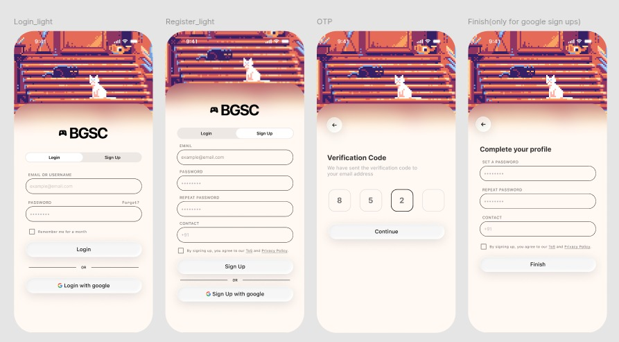

# Authentication (Login / Register / Verify / Complete Profile) — UI/UX Specification

**Platform:** Mobile (React Native / Expo)
**Routes:** `/login`, `/register`, `/auth/callback` (`src/app/login.tsx`, `src/app/register.tsx`, `src/app/auth/callback.tsx`)
**Visibility:** Public (Guests + logged-out users re-authenticating)
**Source:** Complete Feature Specification & Architecture §5.1 (Login / Registration) and §3.3 (Authentication States); Screen Inventory "Auth".
**Design reference:** `screens/assets/auth-screens-light.png` (light mode)



> This single spec covers the whole unlit auth funnel because the design presents Login and Sign Up as **one screen with a segmented toggle**, with two follow-on screens (OTP verification, Complete Profile) sharing the same shell.

---

## 1. Screen Inventory & Flow

| # | Screen | Entry | Purpose |
|---|---|---|---|
| 1 | **Login** | App launch (logged out), guest "Login" CTA, `/login` redirect | Authenticate an existing user |
| 2 | **Sign Up** | "Sign Up" toggle on the auth screen | Create a new account (email) |
| 3 | **Verification Code (OTP)** | After email Sign Up submit | Verify ownership of the email address |
| 4 | **Complete Profile** | After **Google** sign-up of a *new* user | Collect password + contact missing from the OAuth profile |
| — | **Auth Callback** | Google OAuth redirect | Exchanges the OAuth code, then routes to Complete Profile (new) or Home (existing) |

### 1.1 Flow Diagram

```
                       ┌─────────────┐
        ┌──────────────│  Auth Screen │──────────────┐
        │  (Login tab) └─────────────┘ (Sign Up tab) │
        ▼                                            ▼
  [Login submit]                              [Sign Up submit]
        │                                            │
        │                                     ┌──────────────┐
        │                                     │ Verification │  ← email OTP
        │                                     │ Code (OTP)   │
        │                                     └──────────────┘
        │                                            │ Continue
        ▼                                            ▼
   ┌─────────┐                            ┌─────────────────────┐
   │  Home   │ ◀──────────────────────────│ Get Started / Onboard│  (separate modal spec)
   └─────────┘        (existing user)     └─────────────────────┘
        ▲                                            ▲
        │                                            │
   ┌──────────────┐   new user    ┌─────────────────────────┐
   │ Auth Callback │──────────────▶│ Complete Profile (Google)│
   └──────────────┘   existing →Home└─────────────────────────┘
        ▲
   [Login/Sign Up with Google] → system browser OAuth → callback
```

**Forgot password** branches off the Login screen and reuses the OTP screen pattern (see §7).

---

## 2. Shared Shell (all 4 screens)

Every auth screen shares the same vertical composition:

```
┌─────────────────────────────────────┐
│         Status bar (9:41 …)         │
├─────────────────────────────────────┤
│                                     │
│        Pixel-art Hero Banner        │  ← full-bleed, ~38–42% height
│        (retro arcade mascot)        │
│       ↓ fades into page bg ↓        │
├─────────────────────────────────────┤
│            ⬛ BGSC wordmark          │  ← gamepad glyph + "BGSC"
│                                     │
│      [ screen-specific content ]    │  ← scrollable; keyboard-aware
│                                     │
└─────────────────────────────────────┘
```

- **No Dynamic Status Bar / drawer here** — auth screens are outside the `(drawer)` group. Only the OS status bar shows.
- **Hero banner:** Full-width pixel-art illustration (retro arcade mascot on stadium seating) that bleeds under the OS status bar and **fades via a vertical gradient** into the page background. Static, non-interactive. Identical art across all 4 screens; it shrinks slightly on the OTP / Complete Profile screens to make room for content.
- **BGSC wordmark:** Centered controller/gamepad glyph + "BGSC" lockup, sitting just below the hero.
- **Back button:** Screens 3 & 4 (OTP, Complete Profile) show a circular ← button (white, soft shadow) below the hero, top-left, returning to the previous step.
- **Keyboard handling:** Content area uses `KeyboardAvoidingView`; the hero may compress and content scrolls so focused inputs and the primary button stay visible.
- **Theme:** Mockups are **light mode**. Dark mode mirrors the same layout using dark tokens (§9); the pixel-art hero and the dark primary-button gradient remain constant across themes.

---

## 3. Auth Mode Toggle (Login ↔ Sign Up)

A segmented control directly under the wordmark on screens 1 & 2.

```
┌───────────────────────────┐
│ [   Login   ] [ Sign Up ] │   ← active = white pill on a light track
└───────────────────────────┘
```

- Two segments: **Login** · **Sign Up**.
- Active segment = white pill with soft shadow; inactive = transparent over the muted track.
- Tapping a segment swaps the form below it (subtle crossfade/slide). Field contents are **not** carried across modes.
- The toggle is **absent** on the OTP and Complete Profile screens (those are linear follow-on steps reached via the back button instead).

---

## 4. Screen 1 — Login

### 4.1 Layout (below wordmark + toggle)

```
EMAIL OR USERNAME
┌─────────────────────────────────┐
│ example@email.com               │
└─────────────────────────────────┘

PASSWORD                   Forgot?
┌─────────────────────────────────┐
│ ••••••••                        │
└─────────────────────────────────┘

☐ Remember me for a month

┌─────────────────────────────────┐
│            Login                │   ← primary
└─────────────────────────────────┘
──────────────── OR ────────────────
┌─────────────────────────────────┐
│  G   Login with google          │   ← outlined
└─────────────────────────────────┘
```

### 4.2 Fields & Controls

| Element | Type | Notes |
|---|---|---|
| Email or Username | Text input | Required. Accepts either; `autoCapitalize=none`, no autocorrect. Placeholder `example@email.com` |
| Password | Secure text input | Required. Show/hide toggle recommended (eye icon) |
| Forgot? | Link (right of PASSWORD label) | → Forgot Password flow (§7) |
| Remember me for a month | Checkbox | Session persistence ("Keep me logged in", spec §5.1). When on, the session is retained ~30 days; off → session-scoped |
| Login | Primary button | Validates → authenticates → routes to Home (`/`) |
| OR divider | — | Visual separator |
| Login with google | Outlined button | Launches Google OAuth (§6) |

### 4.3 Behaviour & States

- **Login disabled** until both fields are non-empty; shows a spinner / "Please wait…" while submitting.
- **Invalid credentials:** inline error banner above the button — "Incorrect email/username or password." Fields retain input.
- **Unverified email (edge case):** if the account exists but email isn't verified, route to the OTP screen (§5.3) to complete verification.
- **Network error:** toast "Couldn't reach the server — check your connection."
- On success: `router.replace('/')`.

---

## 5. Screen 2 — Sign Up

### 5.1 Layout

```
EMAIL
┌─────────────────────────────────┐
│ example@email.com               │
└─────────────────────────────────┘
PASSWORD
┌─────────────────────────────────┐
│ ••••••••                        │
└─────────────────────────────────┘
REPEAT PASSWORD
┌─────────────────────────────────┐
│ ••••••••                        │
└─────────────────────────────────┘
CONTACT
┌─────────────────────────────────┐
│ +91                             │
└─────────────────────────────────┘

☐ By signing up, you agree to our ToS and Privacy Policy

┌─────────────────────────────────┐
│           Sign Up               │   ← primary
└─────────────────────────────────┘
──────────────── OR ────────────────
┌─────────────────────────────────┐
│  G   Sign Up with google        │   ← outlined
└─────────────────────────────────┘
```

### 5.2 Fields & Controls

| Field | Type | Required | Notes |
|---|---|---|---|
| Email | Text input | ✓ | Unique; `keyboardType=email-address`, `autoCapitalize=none`. Placeholder `example@email.com` |
| Password | Secure input | ✓ | Enforce strength rules (min length etc.); show/hide toggle |
| Repeat Password | Secure input | ✓ | Must match Password |
| Contact | Phone input | ✓ (per design) | Prefilled `+91` country prefix; numeric keypad |
| ToS / Privacy consent | Checkbox + links | ✓ | "ToS" and "Privacy Policy" are tappable links opening the respective documents |
| Sign Up | Primary button | — | Disabled until valid; submits → OTP verification (§5.3) |
| Sign Up with google | Outlined button | — | Google OAuth (§6) |

### 5.3 Behaviour & States

- **Sign Up disabled** until: email valid, password meets rules, repeat matches, contact valid, and consent checked.
- **Inline validation:** per-field errors (e.g., "Passwords don't match", "Enter a valid email"). The mismatch check fires on blur of Repeat Password.
- **Email already registered:** inline error on the Email field — "An account with this email already exists. Log in instead."
- On valid submit → create the pending account → send a 4-digit code to the email → navigate to **Verification Code** (§5 → OTP screen below).

> **Spec divergence (flag):** Feature Spec §5.1 lists **Username (required, unique)** and a **mandatory Sponsor selection** at registration; the mockup's Sign Up form collects neither. The working assumption is that **username and sponsor selection are gathered in the Get Started / Onboarding modal** (separate spec) immediately after verification. Confirm whether username should instead be added to this form. See §11.

---

## 6. Screen 3 — Verification Code (OTP)

### 6.1 Layout

```
   ( ← )

   Verification Code
   We have sent the verification code to
   your email address

   ┌────┐ ┌────┐ ┌────┐ ┌────┐
   │  8 │ │  5 │ │  2 │ │    │      ← 4 digit cells
   └────┘ └────┘ └────┘ └────┘

   ┌─────────────────────────────┐
   │          Continue           │   ← primary
   └─────────────────────────────┘
```

### 6.2 Components & Behaviour

- **Heading:** "Verification Code" (bold). **Subtitle:** "We have sent the verification code to your email address" (muted). Optionally append the masked email.
- **OTP input:** 4 individual rounded-square cells. Typing auto-advances to the next cell; backspace moves back; paste fills all cells. The focused/filled cell border is emphasised.
- **Continue:** Enabled only when all 4 digits are entered; verifies the code.
- **Resend:** A "Resend code" link with a countdown (e.g., "Resend in 0:30") — required UX even though not drawn in the mock; place below the cells or button.
- **Errors:** Wrong code → cells flash red + inline "Incorrect code, try again." Expired → "Code expired — resend a new one."
- **On success:** email-signup users continue to **Get Started / Onboarding** (sponsor selection, interests, etc. — separate spec), then Home.

---

## 7. Screen 4 — Complete Profile (Google sign-ups only)

Shown only when a **new** user authenticates via Google and the OAuth profile lacks a password/contact.

### 7.1 Layout

```
   ( ← )

   Complete your profile

   SET A PASSWORD
   ┌─────────────────────────────┐
   │ ••••••••                    │
   └─────────────────────────────┘
   REPEAT PASSWORD
   ┌─────────────────────────────┐
   │ ••••••••                    │
   └─────────────────────────────┘
   CONTACT
   ┌─────────────────────────────┐
   │ +91                         │
   └─────────────────────────────┘

   ☐ By signing up, you agree to our ToS and Privacy Policy

   ┌─────────────────────────────┐
   │           Finish            │   ← primary
   └─────────────────────────────┘
```

### 7.2 Fields & Behaviour

| Field | Type | Required | Notes |
|---|---|---|---|
| Set a Password | Secure input | ✓ | Same strength rules as Sign Up |
| Repeat Password | Secure input | ✓ | Must match |
| Contact | Phone input | ✓ | `+91` prefix |
| ToS / Privacy consent | Checkbox + links | ✓ | Same as Sign Up |
| Finish | Primary button | — | Disabled until valid; completes the account → Get Started / Onboarding → Home |

- Email is already known from Google and is **not** re-collected (optionally shown read-only as context).
- No OTP step is needed (Google has verified the email).

---

## 8. Google OAuth & Auth Callback

- **Trigger:** "Login with google" / "Sign Up with google" buttons.
- Opens the Google consent screen via the system browser (`expo-web-browser`), using `AuthRepository.googleAuthUrl()`.
- Redirects to `/auth/callback`, which **exchanges the code for tokens** and then:
  - **Existing, complete account** → `router.replace('/')` (Home).
  - **New account** → **Complete Profile** (§7).
- **Callback UI:** minimal centered loader on the shared shell ("Signing you in…"). On failure, show an error with a "Back to login" action.

---

## 9. Visual Language (observed from the mockup)

> Captured here for implementation; these values are consolidated in the shared **`design-system.md`** (repo root). Where they diverge from the current `core/theme/tokens.ts` (a purple/slate theme), that's flagged in §11 — treat `design-system.md` as the source of intent, not yet adopted in code.

### 9.1 Color (light mode, approximate)

| Token | Use | Approx. value |
|---|---|---|
| Hero art | Pixel illustration | Warm retro palette: burnt orange / coral / cream highlights |
| Page background | Below hero | White → warm cream vertical fade (`#FFFFFF` → ~`#FFF6F0`) |
| Primary button | Login / Sign Up / Continue / Finish | **Dark gradient** (deep plum/navy → warm dark), white label |
| Input fill | Text fields | White `#FFFFFF` |
| Input border | Text fields / OTP cells | Soft lavender-grey (~`#E6E3F0`) |
| Field label | Uppercase labels | Muted grey (~`#8A8794`), letter-spaced |
| Link | Forgot? / ToS / Privacy | Underlined; accent (warm/plum) |
| Segmented track | Toggle background | Light grey (~`#EFEDF4`); active pill white + shadow |
| Google button | Outlined | White fill, soft border, multicolor "G" |

### 9.2 Typography

| Role | Style |
|---|---|
| Screen heading ("Verification Code", "Complete your profile") | Bold, ~20–22 sp, `text` color |
| Subtitle / helper | Regular, ~13–14 sp, muted |
| Field label | Uppercase, ~11–12 sp, muted, +letter-spacing |
| Input text | ~15 sp |
| Button label | Semibold, ~15–16 sp |
| Links | ~12–13 sp, underlined |

### 9.3 Components

- **Inputs:** fully-rounded "pill" shape (large border-radius, ~22–28 dp), 1 px border, generous horizontal padding, single-line height.
- **Primary button:** full-width pill, dark gradient fill, centered semibold label, ~52 dp tall.
- **Outlined (Google) button:** full-width pill, 1 px border, leading "G" logo.
- **Segmented toggle:** pill track containing two equal segments; active = elevated white pill.
- **OTP cells:** 4 rounded-square cells (~56×56 dp), centered digit.
- **Checkbox:** small square, accent fill when checked, label/links to the right.
- **Back button:** 36–40 dp circular, white, soft shadow, "←".
- **OR divider:** centered "OR" between two hairline rules.

---

## 10. Interaction Summary Table

| Element | Gesture / Event | Outcome |
|---|---|---|
| Login / Sign Up segment | Tap | Swaps the active form |
| Email/Username, Password, etc. | Focus | Keyboard opens; shell scrolls to keep field + button visible |
| Show/hide password (eye) | Tap | Toggles secure entry |
| Forgot? | Tap | Opens Forgot Password flow (§7 reuse) |
| Remember me | Tap | Toggles 30-day session persistence |
| Login | Tap | Validates → authenticates → Home |
| Sign Up | Tap | Validates → sends OTP → Verification screen |
| ToS / Privacy links | Tap | Open respective documents |
| Login/Sign Up with Google | Tap | System-browser OAuth → callback |
| OTP cell | Type / paste | Auto-advance; paste fills all cells |
| Resend code | Tap (after countdown) | Re-sends OTP, restarts countdown |
| Continue (OTP) | Tap | Verifies code → onboarding |
| Back (← ) | Tap | Returns to previous step |
| Finish (Complete Profile) | Tap | Saves password + contact → onboarding |

---

## 11. Validation, Errors & Edge Cases

| Case | Handling |
|---|---|
| Empty/invalid email | Inline field error; primary button disabled |
| Password mismatch (Sign Up / Complete Profile) | Inline error on Repeat field (on blur) |
| Weak password | Inline hint with the rule that failed |
| Email already registered (Sign Up) | Inline error + "Log in instead" link |
| Wrong / expired OTP | Cell shake + inline message; offer Resend |
| Consent unchecked | Sign Up / Finish disabled |
| Invalid login credentials | Error banner above primary button |
| Network / server error | Toast; form state preserved |
| OAuth cancelled / failed | Return to auth screen with a dismissible error |

---

## 12. Loading States

- **Primary buttons:** show inline spinner + "Please wait…" while a request is in flight; button disabled.
- **Auth Callback:** centered loader ("Signing you in…") on the shared shell.
- **OTP verify / Resend:** spinner on the respective control; cells locked during verify.

---

## 13. Open Questions / Notes

1. **Username field** — design omits it though §5.1 requires a unique username. Assumed collected in Onboarding; confirm vs. adding to the Sign Up form.
2. **Sponsor selection** — §5.1 marks it mandatory at registration; design defers it to the Get Started / Onboarding modal (separate spec). Confirm placement.
3. **Color system divergence** — mockup is a warm orange/cream + dark-ink + burnt-orange-accent theme; current `core/theme/tokens.ts` is purple (`#7c3aed`) on slate. See `design-system.md` §2 and §11 for the canonical tokens and the planned `tokens.ts` migration.
4. **Dark mode** — only light mockups provided; dark variants proposed in `design-system.md` §2 — to be confirmed.
5. **OTP length** — design shows 4 cells; confirm 4 vs. 6 digits with the backend/auth provider.
6. **Google sign-up password** — design collects a password on Complete Profile even for OAuth users; confirm this is intended (enables email/password login later) vs. OAuth-only.
