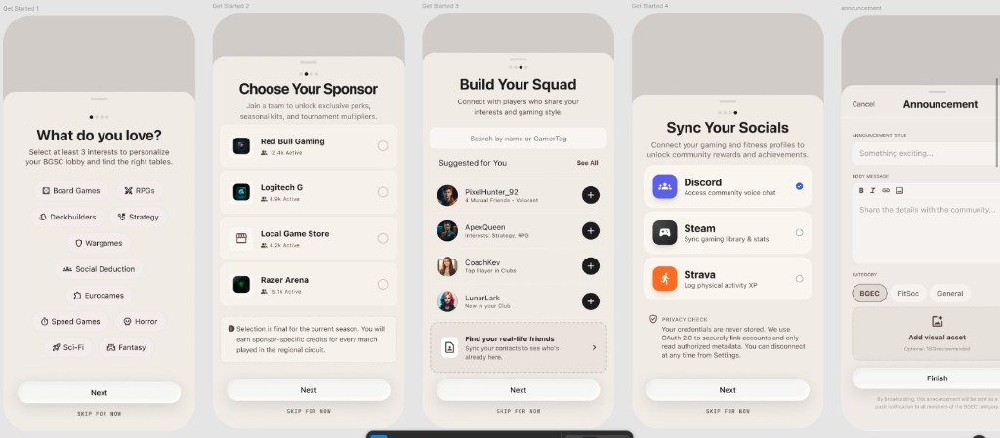
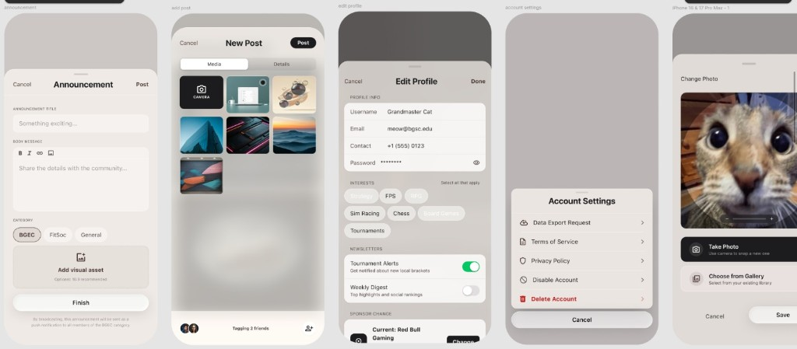
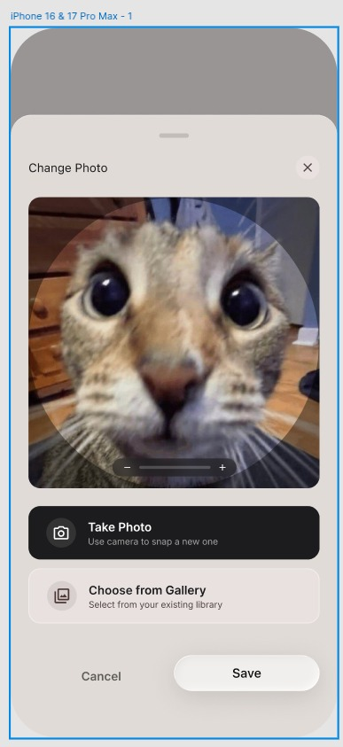

# Popups & Modals — UI/UX Specification

**Platform:** Mobile (React Native / Expo)
**Visibility:** Mostly Authenticated (each modal notes its own rule)
**Source:** Screen Inventory "Popups & Modals (Both Platforms)"; Complete Feature Specification & Architecture §6.1 (Account Action Popup), §6.2 (Get Started), §6.3 (Interest Fields), §6.4 (Make Announcement), §6.5 (Add Post)
**Design references:**
- `screens/assets/modals-onboarding.png` — Get Started steps 1–4
- `screens/assets/modals-account.png` — Make Announcement · New Post · Edit Profile · Account Settings
- `screens/assets/modal-change-photo.png` — Change Photo




> This single spec collects the platform's popups/modals, mirroring the `screens.md` "Popups & Modals" grouping. Two of them — **Make Announcement** and **Add Post** — are already specced as part of `home-page.md` (§8 and §10); this doc captures their **visual design** from the new mockups and flags any deltas rather than restating behaviour.

---

## 1. Shared Modal Conventions

Two presentation shells are used across all modals:

### 1.1 Full-screen sheet (form modals)
Used by **Get Started**, **Make Announcement**, **New Post**, **Edit Profile**.

```
┌─────────────────────────────────────┐
│  Cancel        Title          Action│  ← header row; action = Post/Done/Finish
├─────────────────────────────────────┤
│                                     │
│            Scrollable body          │
│                                     │
├─────────────────────────────────────┤
│        [ Primary CTA / Next ]       │  ← pinned bottom (where applicable)
└─────────────────────────────────────┘
```

- **Header:** left **Cancel** (text), centered **title** (bold), right **primary action** (filled pill — "Post" / "Done" / "Finish") or a "Next" pinned at the bottom for stepped flows.
- **Dismiss:** Cancel, swipe-down on the sheet, or the device back gesture. If the form is dirty, show a **"Discard?"** confirmation (consistent with home-page.md §8/§10).
- Presented as an iOS `pageSheet`/`fullScreen` modal; keyboard-aware (`KeyboardAvoidingView`).

### 1.2 Bottom sheet (action & picker modals)
Used by **Account Settings** and **Change Photo**.

```
┌─────────────────────────────────────┐
│           (dimmed backdrop)         │
│  ┌───────────────────────────────┐  │
│  │  ━━━  (drag handle)           │  │
│  │  Sheet content                │  │
│  └───────────────────────────────┘  │
└─────────────────────────────────────┘
```

- Rounded-top sheet over a dimmed scrim. **Drag handle** at top.
- **Dismiss:** tap scrim, swipe down, Cancel button, or ✕.

### 1.3 Visual language
Reuses the auth-screen vocabulary (see `login-register-page.md` §9) consolidated in **`design-system.md`** (repo root): pill inputs, uppercase muted section labels, full-width pill buttons, segmented toggles, warm/cream surfaces, dark-ink primary actions, and burnt-orange accent. Destructive actions use red.

---

## 2. Get Started / Onboarding

**Trigger:** Automatically after first successful registration / first Google sign-up completion (handoff from `login-register-page.md`).
**Visibility:** Authenticated (new users).
**Appearance:** Full-screen sequential flow of **4 steps** with a progress-dot indicator at the top. Each step has a **"Next"** primary button and a **"SKIP FOR NOW"** text link beneath it.

> **Resolves auth open questions:** This flow is where mandatory **Sponsor selection** (Feature Spec §5.1) and **interest fields** are collected — they are intentionally absent from the Sign Up form. (Username is still collected at Sign Up / derived — see §2.5 note.)

### 2.1 Step 1 — Interest Fields ("What do you love?")

```
            ● ○ ○ ○
   What do you love?
   Select at least 3 interests to personalize
   your BGSC lobby and find the right tables.

   [Board Games] [RPGs] [Deckbuilders]
   [Strategy] [Wargames] [Social Deduction]
   [Eurogames] [Speed Games] [Horror]
   [Sci-Fi] [Fantasy]

   [           Next           ]
            SKIP FOR NOW
```

- **Interest chips** (multi-select, toggle): Board Games, RPGs, Deckbuilders, Strategy, Wargames, Social Deduction, Eurogames, Speed Games, Horror, Sci-Fi, Fantasy. Each chip has a small leading glyph. Selected = filled accent; unselected = outlined.
- **Minimum 3** required: "Next" is disabled until ≥3 chips are selected; helper text reinforces the rule.
- Maps to the broader interest domains in the Feature Spec (Sports, Esports, Gaming Industry, Game Dev); the chip set shown is tabletop-flavoured and should be sourced from the live catalogue.
- This step is the reusable **Interest Fields** modal (also opened from Edit Profile / periodic prompt).

### 2.2 Step 2 — Choose Your Sponsor

```
            ○ ● ○ ○
   Choose Your Sponsor
   Join a team to unlock exclusive perks,
   seasonal kits, and tournament multipliers.

   ┌─────────────────────────────────┐
   │ [logo] Red Bull Gaming          ○ │
   │        👥 12.4k Active            │
   ├─────────────────────────────────┤
   │ [logo] Logitech G               ○ │
   │        👥 8.9k Active             │
   ├─────────────────────────────────┤
   │ [logo] Local Game Store         ○ │
   │        👥 4.2k Active             │
   ├─────────────────────────────────┤
   │ [logo] Razer Arena              ○ │
   │        👥 19.1k Active            │
   └─────────────────────────────────┘
   ⓘ Selection is final for the current season.
     You will earn sponsor-specific credits for
     every match played in the regional circuit.

   [           Next           ]
            SKIP FOR NOW
```

- **Single-select** list of active sponsors for the current semester/year (radio on the right). Each row: sponsor logo, name, and affiliated-user "Active" count.
- **Finality notice:** sponsor choice is locked for the season (changeable later only via the once-per-semester "Change Sponsor" — see Edit Profile §6).
- **Mandatory per Feature Spec §5.1** — however the mockup still shows "SKIP FOR NOW". **Flag:** confirm whether sponsor selection may be skipped during onboarding (and prompted later) or is a hard gate. See §2.5.
- "Next" enabled once one sponsor is selected (or always, if skip is allowed).

### 2.3 Step 3 — Build Your Squad (Add Friends)

```
            ○ ○ ● ○
   Build Your Squad
   Connect with players who share your
   interests and gaming style.

   [🔍 Search by name or GamerTag        ]

   Suggested for You              See All
   ┌─────────────────────────────────┐
   │ [av] PixelHunter_92           (＋)│
   │      4 Mutual Friends · Valorant  │
   │ [av] ApexQueen                (＋)│
   │      Interests: Strategy, RPG     │
   │ [av] CoachKev                 (＋)│
   │      Top Player in Clubs          │
   │ [av] LunarLark                (＋)│
   │      New in your Club             │
   └─────────────────────────────────┘
   ┌─────────────────────────────────┐
   │ Find your real-life friends     ›│
   │ Sync your contacts to see who's  │
   │ already here.                    │
   └─────────────────────────────────┘

   [           Next           ]
            SKIP FOR NOW
```

- **Search bar:** find users by name or GamerTag.
- **"Suggested for You"** list with a **"See All"** link. Each row: avatar, display name, a contextual reason line (mutual friends + game, shared interests, "Top Player in Clubs", "New in your Club"), and an **add (＋)** button that toggles to a sent/added state on tap.
- **Contact sync card:** "Find your real-life friends — Sync your contacts to see who's already here." Tapping requests contacts permission and runs contact-matching.
- Adding here sends friend requests (or follows) per the friends-system rules.

### 2.4 Step 4 — Sync Your Socials (Connect Socials)

```
            ○ ○ ○ ●
   Sync Your Socials
   Connect your gaming and fitness profiles to
   unlock community rewards and achievements.

   ┌─────────────────────────────────┐
   │ [Discord] Discord              ✓ │
   │           Access community voice  │
   ├─────────────────────────────────┤
   │ [Steam]  Steam                 ○ │
   │           Sync gaming library&stats│
   ├─────────────────────────────────┤
   │ [Strava] Strava                ○ │
   │           Log physical activity XP │
   └─────────────────────────────────┘
   🔒 PRIVACY CHECK: Your credentials are never
      stored. We use OAuth 2.0 to securely link
      accounts and only read authorized metadata.
      You can disconnect at any time from Settings.

   [           Next           ]   (→ Finish / Home)
            SKIP FOR NOW
```

- **Connectable providers:** Discord (community voice chat), Steam (gaming library & stats), Strava (physical activity XP). Each row toggles its OAuth-connected state (checkmark when linked).
- Tapping a provider launches its OAuth flow (system browser); on return the row shows connected.
- **Privacy note** reassures OAuth-only, metadata-read, disconnect-anytime.
- On this final step, "Next" completes onboarding → routes to **Home**. "SKIP FOR NOW" also completes onboarding.

### 2.5 Flow Behaviour & Notes

- **Progress dots** (4) update per step; back-navigation via device gesture returns to the previous step preserving entries.
- **Skip:** any step may be skipped except where Sponsor selection is enforced (see flag). Skipped steps can be completed later from the profile/settings.
- **Open questions / flags:**
  1. **Username** — not collected here or on the Sign Up form; confirm it's gathered at Sign Up or derived from email. (Carried over from `login-register-page.md` §13.)
  2. **Sponsor skip vs. gate** — §5.1 says mandatory but mockup shows "SKIP FOR NOW"; confirm.
  3. **Interest taxonomy** — reconcile the tabletop-flavoured chips shown with the Feature Spec's Sports/Esports/Game Dev domains.

---

## 3. Make Announcement

**Trigger:** `+` on the Announcements tab (home-page.md §5.5).
**Visibility:** Core+ with announcement permission.
**Behaviour spec:** See `home-page.md` §8 (fields, validation, schedule toggle, WhatsApp rate-limit error states). This section records the **visual design** from `modals-account.png`.

```
┌─────────────────────────────────────┐
│  Cancel     Announcement       Post │
├─────────────────────────────────────┤
│  ANNOUNCEMENT TITLE                 │
│  ┌───────────────────────────────┐  │
│  │ Something exciting…           │  │
│  └───────────────────────────────┘  │
│  BODY MESSAGE                       │
│  [ B  I  🔗  🖼 ]                    │  ← rich-text toolbar
│  ┌───────────────────────────────┐  │
│  │ Share the details with the    │  │
│  │ community…                    │  │
│  └───────────────────────────────┘  │
│  CATEGORY                           │
│  [BGEC] [FitSoc] [General]          │
│  ┌───────────────────────────────┐  │
│  │  🖼  Add visual asset          │  │
│  │  Upload · 16:9 recommended    │  │
│  └───────────────────────────────┘  │
│  [            Finish            ]   │
│  By broadcasting, this announcement │
│  is sent as a push notification to  │
│  all members of the BGEC category.  │
└─────────────────────────────────────┘
```

**Design deltas vs. `home-page.md` §8 (flag for reconciliation):**
- The mockup's header action says **"Post"** (top-right) *and* there's a **"Finish"** primary button at the bottom — confirm which is canonical (recommend a single bottom primary).
- **Rich-text toolbar** (Bold, Italic, link, image) is shown — this satisfies §8's "rich-text editor" requirement that the current implementation stubs as plain text.
- **Category** shows only **BGEC / FitSoc / General** (3 chips) vs. the full 9-tag set in home-page.md §5/§8. Confirm whether this modal uses a reduced grouping or the full tag list.
- **"Add visual asset" (16:9)** image upload is new — not in §8. Add it to the announcement model/spec.
- **Schedule toggle** from §8 is not visible in the mockup — confirm it still belongs.
- Footer **push-notification disclosure** is a nice addition; keep it (dynamic to the selected category).

---

## 4. Add Post (New Post)

**Trigger:** FAB on the Feed tab (home-page.md §6.4) / Friends feed.
**Visibility:** Authenticated.
**Behaviour spec:** See `home-page.md` §10. Visual design from `modals-account.png`:

```
┌─────────────────────────────────────┐
│  Cancel       New Post         Post │
├─────────────────────────────────────┤
│  [   Media   ] [   Details   ]      │  ← 2-tab segmented
│  ┌─────┐ ┌─────┐ ┌─────┐            │
│  │📷CAM│ │ img │ │ img │            │  ← capture tile + thumbnails
│  └─────┘ └─────┘ └─────┘            │
│  ┌─────┐ ┌─────┐ ┌─────┐            │
│  │ img │ │ img │ │ img │            │
│  └─────┘ └─────┘ └─────┘            │
│                                     │
├─────────────────────────────────────┤
│  [av][av] Tagging 2 friends     👥+ │  ← friend tagging row
└─────────────────────────────────────┘
```

**Design deltas vs. `home-page.md` §10 (flag for reconciliation):**
- Mockup uses a **2-tab segmented control (Media / Details)** with **Post** in the header, whereas the current implementation uses a **3–4 step wizard** (Media → Details → Privacy → Music) with Back/Next. Confirm the canonical pattern (recommend aligning to the mockup's lighter 2-tab + header-Post model, folding Privacy controls into "Details").
- **Friend tagging** ("Tagging 2 friends" + add-person) is shown here but not in §10 — add tagging to the Add Post spec/model.
- The **Media tab** shows an inline 3-column grid with a leading **Camera capture tile** — matches §10's camera/gallery + preview grid intent.

---

## 5. Edit Profile (Account Action — Edit)

**Trigger:** Profile avatar tap on the User Profile status bar → Account Actions → **Edit**.
**Visibility:** Authenticated (own profile).
**Appearance:** Full-screen sheet — header **Cancel / "Edit Profile" / Done**.

```
┌─────────────────────────────────────┐
│  Cancel      Edit Profile      Done │
├─────────────────────────────────────┤
│  PROFILE INFO                       │
│  Username   Grandmaster Cat         │
│  Email      meow@bgsc.edu           │
│  Contact    +1 (555) 0123           │
│  Password   ••••••••            👁  │
│                                     │
│  INTERESTS          Select all apply│
│  [FPS] [Sim Racing] [Chess]         │
│  [Board Games] [Tournaments] …      │
│                                     │
│  NEWSLETTERS                        │
│  Tournament Alerts            [ on] │
│   Get notified about new brackets   │
│  Weekly Digest                [off] │
│   Top highlights & social rankings  │
│                                     │
│  SPONSOR                            │
│  Current: Red Bull Gaming   [Change]│
└─────────────────────────────────────┘
```

| Section | Control | Notes |
|---|---|---|
| Profile Info — Username | Text input | Editable; uniqueness validated |
| Profile Info — Email | Text input | Editable; re-verification may apply |
| Profile Info — Contact | Phone input | `+1 (…)` formatted |
| Profile Info — Password | Secure input + eye toggle | Tap to change; show/hide |
| Interests | Multi-select chips | "Select all that apply"; same chip set as Interest Fields (§2.1) |
| Newsletters | Switch per item | Tournament Alerts, Weekly Digest (+ other categories per spec) with helper subtitles |
| Sponsor | Read-out + Change | "Current: [Sponsor]" with **Change** → sponsor picker; **limited to once per semester** (disabled/locked with tooltip if already changed) |
| Header — Done | Primary | Validates & saves; dirty-state discard confirm on Cancel |

- The avatar/photo is changed via the **Change Photo** sheet (§8), reachable from here and from the profile status bar.

---

## 6. Account Settings (Account Action — Actions)

**Trigger:** Profile avatar tap on the User Profile status bar → Account Actions → **Actions**.
**Visibility:** Authenticated (own account).
**Appearance:** **Bottom action sheet** over a dimmed backdrop.

```
┌─────────────────────────────────────┐
│           (dimmed backdrop)         │
│  ┌───────────────────────────────┐  │
│  │        Account Settings       │  │
│  │  ⤓  Data Export Request     › │  │
│  │  📄 Terms of Service        › │  │
│  │  🔒 Privacy Policy          › │  │
│  │  ⏸  Disable Account         › │  │
│  │  🗑  Delete Account          › │  │  ← red / destructive
│  └───────────────────────────────┘  │
│  [            Cancel            ]   │
└─────────────────────────────────────┘
```

| Row | Action |
|---|---|
| Data Export Request | Opens a data-export request flow (GDPR-style); confirmation that export will be emailed |
| Terms of Service | Opens ToS document |
| Privacy Policy | Opens Privacy Policy document |
| Disable Account | Temporary deactivation; confirmation dialog explaining reversibility |
| **Delete Account** | **Destructive** (red); strong confirmation dialog (type-to-confirm or re-auth), warns it's permanent |
| Cancel | Dismisses the sheet |

- Destructive/irreversible actions require an explicit secondary confirmation.

---

## 7. Change Photo (Profile Picture)

**Trigger:** Profile picture tap on the User Profile status bar, or from Edit Profile (§5).
**Visibility:** Authenticated.
**Appearance:** Bottom sheet with drag handle.



```
┌─────────────────────────────────────┐
│  ━━━                                │
│  Change Photo                   (✕) │
│  ┌───────────────────────────────┐  │
│  │     ╭─────────────────╮       │  │
│  │     │  circular crop  │       │  │  ← live crop preview
│  │     ╰─────────────────╯       │  │
│  │        [ −  ====●==  + ]       │  │  ← zoom slider
│  └───────────────────────────────┘  │
│  ┌───────────────────────────────┐  │
│  │ 📷  Take Photo                 │  │  ← dark primary tile
│  │     Use camera to snap a new one│  │
│  └───────────────────────────────┘  │
│  ┌───────────────────────────────┐  │
│  │ 🖼  Choose from Gallery        │  │  ← light tile
│  │     Select from your library    │  │
│  └───────────────────────────────┘  │
│       Cancel            [ Save ]    │
└─────────────────────────────────────┘
```

| Element | Behaviour |
|---|---|
| Close (✕) | Dismiss without saving |
| Circular crop preview | Shows the selected image masked to a circle |
| Zoom slider (− / +) | Scales the image within the crop frame; drag image to reposition |
| Take Photo | Requests camera permission → capture → loads into crop frame |
| Choose from Gallery | Opens system picker → loads selection into crop frame |
| Cancel | Dismiss without saving |
| Save | Commits the cropped avatar; sheet dismisses; profile avatar updates |

- Permission-denied states fall back to a prompt to enable access in Settings.

---

## 8. Interaction Summary Table

| Element | Gesture / Event | Outcome |
|---|---|---|
| Onboarding interest chip | Tap | Toggles selection (≥3 to proceed) |
| Onboarding sponsor row | Tap | Single-selects sponsor |
| Onboarding add-friend (＋) | Tap | Sends friend request; toggles added state |
| Contact-sync card | Tap | Requests contacts permission + matches |
| Social provider row | Tap | Launches OAuth; toggles connected |
| Onboarding Next | Tap | Advances step / finishes → Home |
| Onboarding Skip for now | Tap | Skips step (or finishes on last) |
| Announcement category chip | Tap | Selects category; footer disclosure updates |
| Announcement rich-text tool | Tap | Applies bold/italic/link/image |
| Add visual asset | Tap | Opens media picker (16:9) |
| New Post Media/Details tab | Tap | Switches tab |
| New Post camera tile | Tap | Opens camera |
| New Post tagging row | Tap | Opens friend tagger |
| Edit Profile field | Edit | Updates value (validated) |
| Password eye | Tap | Toggles visibility |
| Sponsor Change | Tap | Opens sponsor picker (once/semester) |
| Newsletter switch | Tap | Toggles subscription |
| Account Settings row | Tap | Opens the respective action/flow |
| Delete / Disable Account | Tap | Opens destructive confirmation |
| Change Photo zoom slider | Drag | Scales crop |
| Take Photo / Gallery | Tap | Camera / picker → crop frame |
| Save (Change Photo) | Tap | Commits avatar |
| Header Cancel (any form modal) | Tap | Dismiss; discard-confirm if dirty |
| Bottom sheet backdrop / handle | Tap / swipe down | Dismiss |

---

## 9. States

| Modal | Loading | Empty | Error |
|---|---|---|---|
| Onboarding — Sponsor | Skeleton sponsor rows | "No active sponsors this season" | Retry inline |
| Onboarding — Squad | Skeleton suggestion rows | "No suggestions yet — try search" | Retry inline |
| Onboarding — Socials | Per-row connect spinner | — | "Couldn't connect [provider]" toast |
| Make Announcement | — | — | Validation inline + WhatsApp rate-limit (home-page.md §8) |
| New Post | Thumbnail load shimmer | "Select media to continue" | Upload error toast, draft preserved |
| Edit Profile | Field skeletons on open | — | Save error toast, values preserved |
| Account Settings | — | — | Action-specific error dialog |
| Change Photo | Crop-preview shimmer | — | Permission-denied prompt |

---

## 10. Loading States

All data-driven modal content uses **skeleton placeholders** consistent with the rest of the app (sponsor rows, friend suggestions, profile fields, media thumbnails). In-flight submissions disable the primary action and show an inline spinner ("Please wait…"). OAuth connects show a per-row spinner until the provider returns.

---

## 11. Open Questions / Notes

1. **Username & Sponsor placement** — see §2.5 (carried from `login-register-page.md`).
2. **Make Announcement deltas** — header "Post" vs bottom "Finish"; reduced 3-category set vs full 9 tags; new "Add visual asset"; schedule-toggle presence (see §3).
3. **Add Post pattern** — 2-tab + header Post (mockup) vs 3–4 step wizard (current implementation); plus new friend-tagging (see §4).
4. **Color system** — modals use the warm/cream auth palette; canonical tokens and the `core/theme/tokens.ts` migration live in `design-system.md` §2 and §11.
5. **Dark mode** — only light mockups provided.
